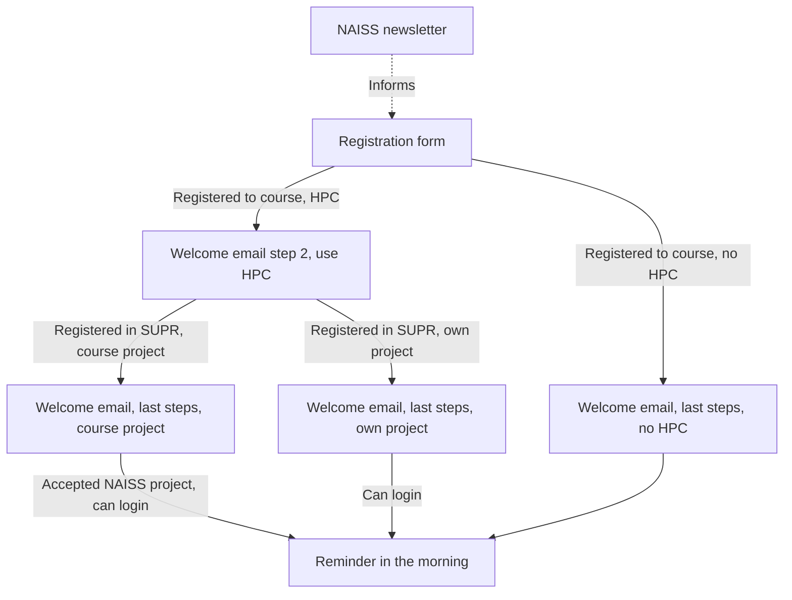

# Communication

- Course date: 2026-03-03



<!-- markdownlint-disable MD013 --><!-- Tables cannot be split up over lines, hence will break 80 characters per line -->

Date                  |Description
----------------------|------------------------------------------------------------------------
2026-01-09            |[Registration form](registration_form.md)
2026-01-09            |[NAISS newsletter, first announcement](newsletter_first_announcement.md)
2026-01-09 and onward |[Welcome email](welcome_email.md)
2026-03-03            |[Reminder in the morning](reminder_in_morning.md)

<!-- markdownlint-enable MD013 -->

Course registration data

Email|Which HPC cluster?|Name

## What is your email address?

```text
[field for one line of text]
```

## Which HPC cluster will you use?

- I will not follow the HPC part of the course
- (recommended) I will use the HPC cluster provided by the course
- I will use the HPC cluster that I already work on

## If you work on your own HPC cluster, what is its name?

Be aware that there are only worked-out answers for the some
NAISS HPC clusters (Alvis, Bianca, COSMOS, Dardel, Kebnekaise,
LUMI, Pelle, Tetralith)

- `[open question]`


