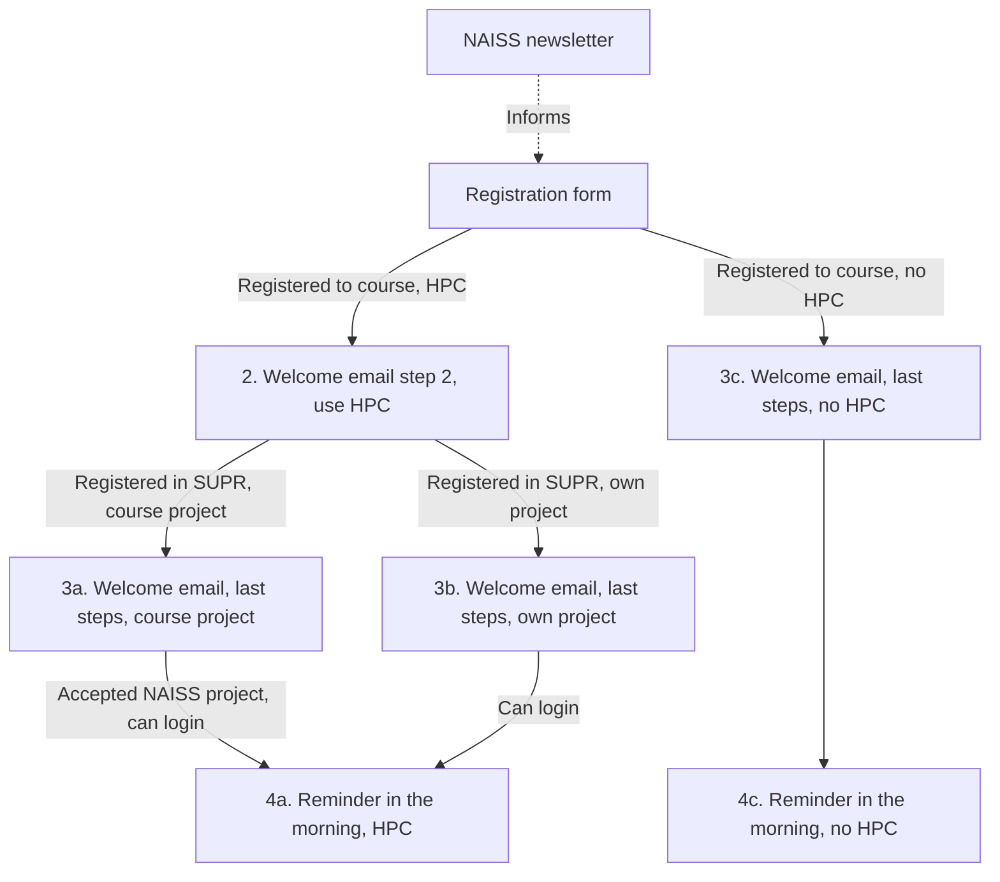

# Communication

- Course date: 2026-03-03

## Workflow

<!-- markdownlint-disable MD013 --><!-- Mermaid cannot be split up over lines, hence will break 80 characters per line -->

<!-- markdownlint-enable MD013 -->

## Emails

<!-- markdownlint-disable MD013 --><!-- Tables cannot be split up over lines, hence will break 80 characters per line -->

Date                  |Description
----------------------|------------------------------------------------------------------------
2026-01-09            |[Registration form](registration_form.md)
2026-01-09            |[NAISS newsletter, first announcement](newsletter_first_announcement.md)
2026-01-09 and onward |[Welcome email](welcome_email.md)
2026-03-03            |[Reminder in the morning](reminder_in_morning.md)

<!-- markdownlint-enable MD013 -->

## Administrative action overview

<!-- markdownlint-disable MD013 --><!-- Tables cannot be split up over lines, hence will break 80 characters per line -->

Email               |Which HPC cluster?|Name of HPC cluster|Registered in SUPR|Sent|Action
--------------------|------------------|-------------------|------------------|----|----------------------------
`pelle@uppmax.uu.se`|No HPC            |.                  |.                 |.   |Send `3c`
`pelle@uppmax.uu.se`|Course HPC        |.                  |.                 |.   |Send `2a`
`pelle@uppmax.uu.se`|Course HPC        |.                  |No                |`2a`|Wait until SUPR registration
`pelle@uppmax.uu.se`|Course HPC        |.                  |Yes               |`2a`|Send `3a`
`pelle@uppmax.uu.se`|Course HPC        |.                  |Yes               |`3a`|Done
`pelle@uppmax.uu.se`|Own HPC           |Rackham            |.                 |.   |Send `3b`
`pelle@uppmax.uu.se`|Own HPC           |Rackham            |.                 |`3b`|Done
`pelle@uppmax.uu.se`|No HPC            |.                  |.                 |`3c`|Done

<!-- markdownlint-enable MD013 -->
