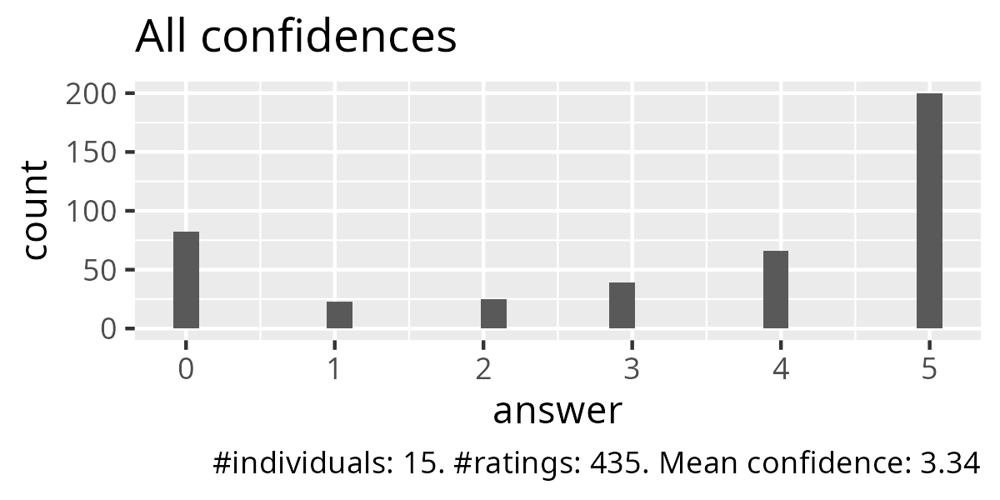
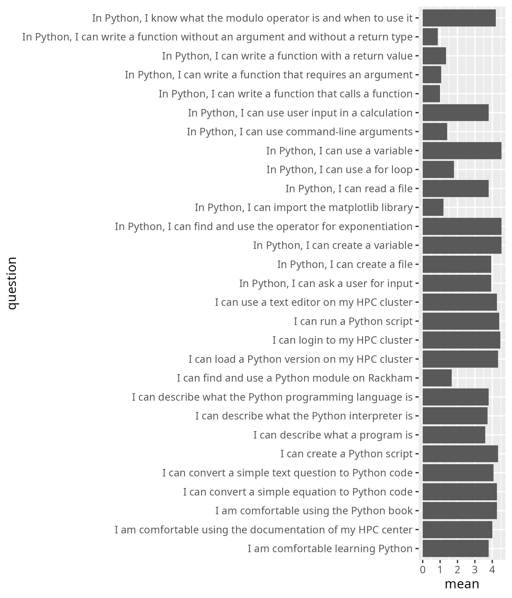
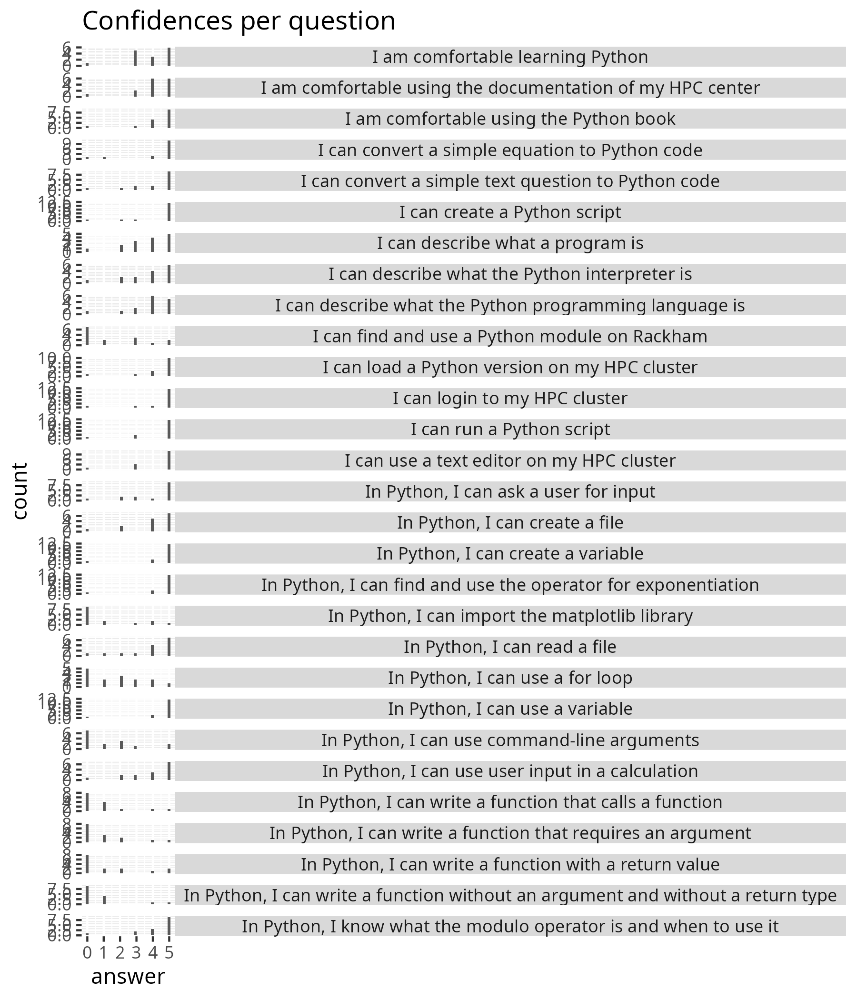

# Evaluation 2025-03-04

- Number of registrations: 67
- Number of participants: 16 (24% show-up rate)
- Number of evaluations:  15 (94% survey response)
- [Reflection](../../reflections/20250304/README.md)

## Results

- [anonymous_evaluations.txt](anonymous_evaluations.txt)
- [survey.csv](survey.csv)
- [survey_text_question.txt](survey_text_question.txt)
- [email.txt](email.txt)
- [success_score.txt](success_score.txt): 82%

## Analysis

- script used: [analyse.R](analyse.R)
- [average_confidences.csv](average_confidences.csv)
- [success_score.txt](success_score.txt)

