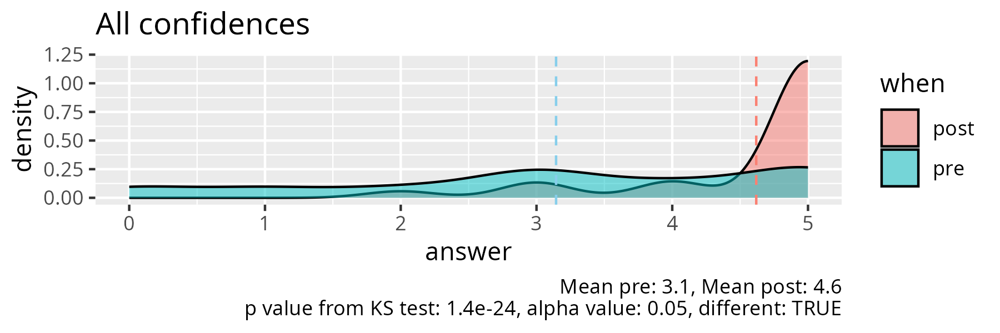

# Evaluation 2025-04-24

- Number of registrations: ?
- Number of participants: ?
- Number of evaluations:  10
- [Lesson plan](../../lesson plans/20250424/README.md)
- [Evaluation](../../evaluations/20250424/README.md)
- [Reflection](../../reflections/20250424/README.md)

## Results

- [anonymous_feedback.txt](anonymous_feedback.txt)
- [survey_start.csv](survey_start.csv)
- [survey_end.csv](survey_end.csv)
- [survey_end_text_question.txt](survey_end_text_question.txt)
- [success_score.txt](success_score.txt): 92%

## [anonymous_feedback.txt](anonymous_feedback.txt)

- The first day of the course was interactive, fun, and really engaging.
  The teacher was very involved and did a great job keeping everyone
  interested and participating. The material is well-structured,
  and the session felt productive from start to finish. Looking forward to more!
- Hello, I will need to leave in half an hour for a doctor's appointment.
  Will that be possible? I think I could keep hearing through my phone.
- Fundamental intro to basics Python are always a good refreshing operation

## Analysis, only end

- script used: [analyse.R](analyse.R)
- [average_confidences.csv](average_confidences.csv)
- [success_score.txt](success_score.txt)

## Analysis, pre and post

- [analyse_pre_post.R](analyse_pre_post.R)
- [stats.md](stats.md)

