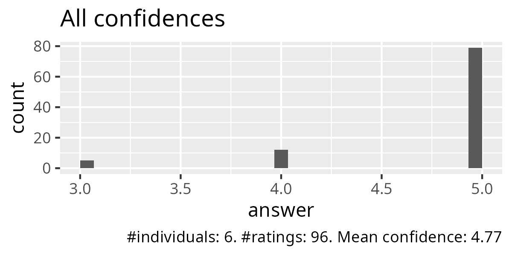
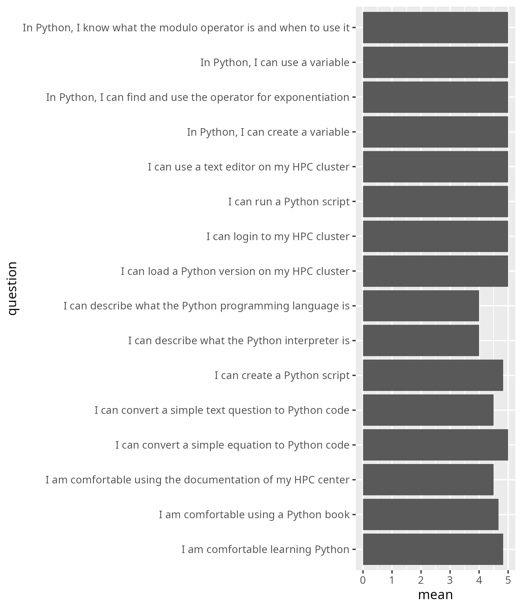
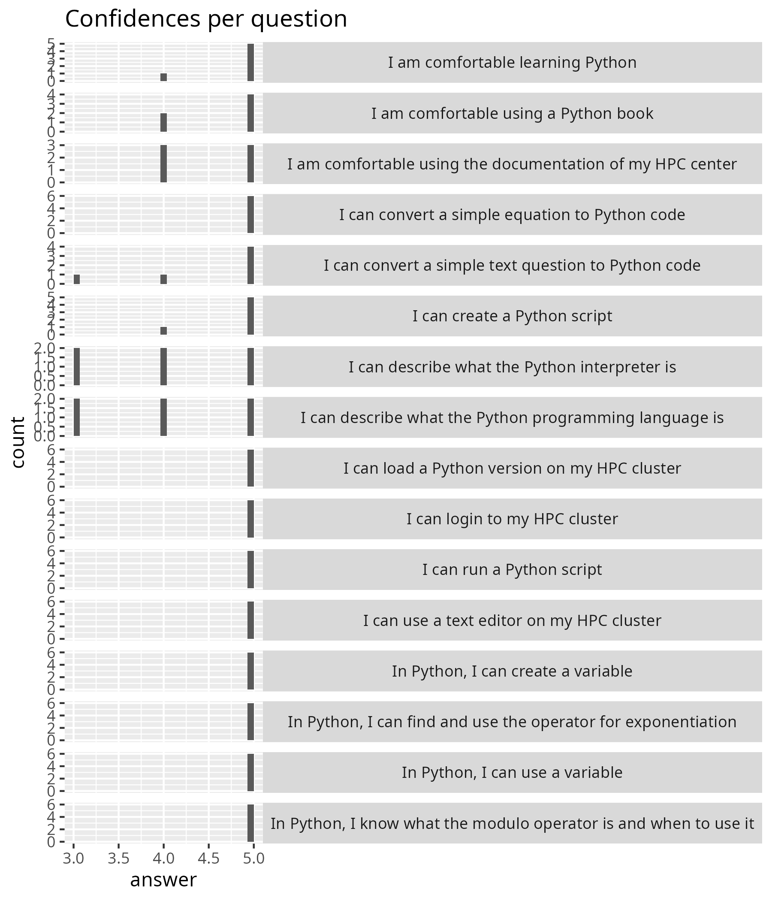
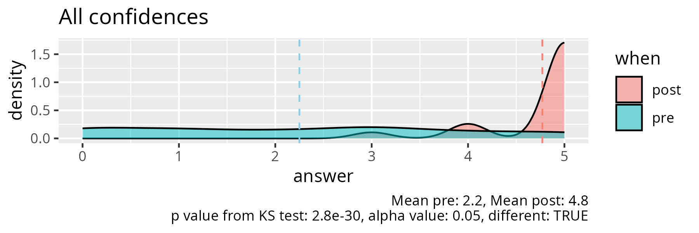
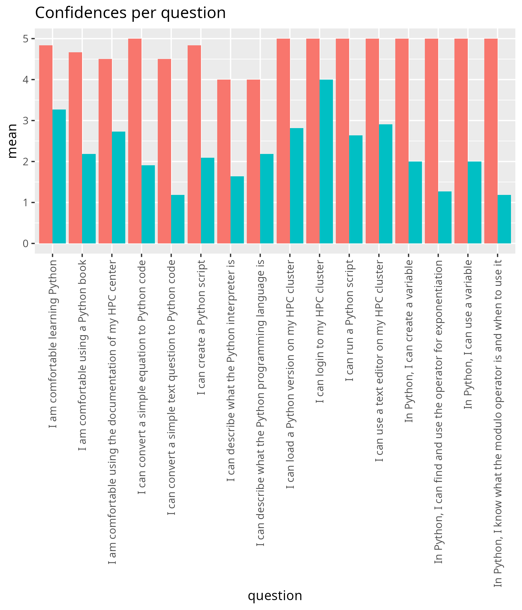
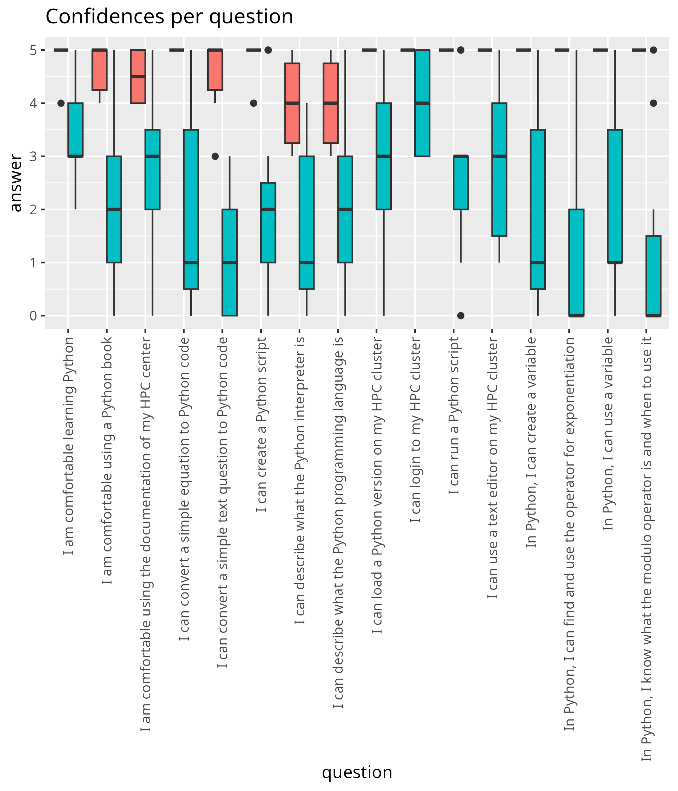
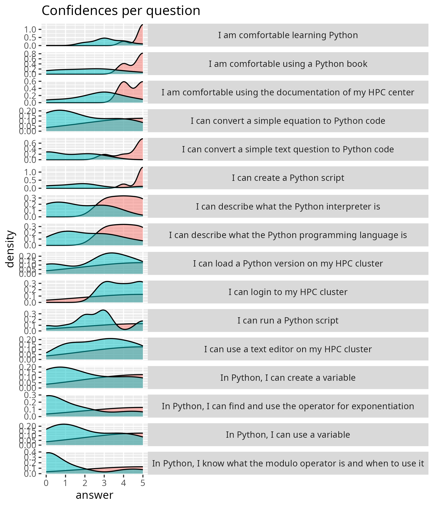

# 2025-10-14

- [Lesson plan](../../lesson_plans/20251014/README.md)
- [Evaluation](../../evaluations/20251014/README.md)
- [Reflection](../../reflections/20251014/README.md)
- Number of non-duplicate registrations: 30
- Number of cancellations: 3
- Number of active participants, whole day: 6 (22%)
- Number of active participants, either half-day: 12
  (some learners attended 1 half-day only) (44%)
- Number of evaluations: 6 (100% fill-in rate by those at the second half-day)

## Results

- [anonymous_feedback.txt](anonymous_feedback.txt)
- [survey_start.csv](survey_start.csv)
- [survey_end.csv](survey_end.csv)
- [survey_end_text_question.txt](survey_end_text_question.txt)
- [success_score.txt](success_score.txt): 95%

## Feedback

From [anonymous_feedback.txt](anonymous_feedback.txt):

- Very well designed and beginner friendly training!
- A very nice basic Python course for beginners
  who want to start using Python on HPC.
  The course website is very informative and tidy. Thanks a lot!

From [survey_end.csv](survey_end.csv):

- On the whole I feel the course was good, just not on the right level for me.
  However, the materials for the 4-day course
  (<https://uppmax.github.io/HPC-python/index.html>)
  led me to some more advanced stuff: automatic code optimization with Numba,
  and indirectly to automatic parallelization with DECO.
- Very nice course for the Python beginner!
- Great course, beginner-friendly!
- Overall, it was a good course for complete beginners.
  However, it would have been nicer to have more discussion
  and less independent reading.
  Much of the material from the Python book could have been replaced
  by direct (faster) explanations from the instructor,
  followed by group discussions and more strictly collaborative exercises.
  This approach would likely have led to faster and more effective learning.
- Since there are already plenty of Python tutorials available online,
  a course like this should focus on being more interactive rather
  than being a space where to work independently through existing materials.
  I also would have appreciated covering some more essential
  yet slightly advanced topics—such as functions, available python packages,
  and similar concepts—instead of spending as much time on very basic material,
  like simple arithmetic with operators.

## Analysis, only end

- script used: [analyse.R](analyse.R)
- [average_confidences.csv](average_confidences.csv)
- [success_score.txt](success_score.txt)

## Analysis, pre and post

- [analyse_pre_post.R](analyse_pre_post.R)
- [stats.txt](stats.txt)

<!-- markdownlint-disable MD013 --><!-- Tables cannot be split up over lines, hence will break 80 characters per line -->

|question                                                         | mean_pre| mean_post|   p_value|different |
|:----------------------------------------------------------------|--------:|---------:|---------:|:---------|
|I am comfortable using the documentation of my HPC center        | 2.727273|  4.500000| 0.0099316|TRUE      |
|I am comfortable using a Python book                             | 2.181818|  4.666667| 0.0048339|TRUE      |
|I am comfortable learning Python                                 | 3.272727|  4.833333| 0.0039403|TRUE      |
|I can login to my HPC cluster                                    | 4.000000|  5.000000| 0.0197055|TRUE      |
|I can load a Python version on my HPC cluster                    | 2.818182|  5.000000| 0.0045775|TRUE      |
|I can describe what the Python programming language is           | 2.181818|  4.000000| 0.0268995|TRUE      |
|I can describe what the Python interpreter is                    | 1.636364|  4.000000| 0.0065500|TRUE      |
|I can use a text editor on my HPC cluster                        | 2.909091|  5.000000| 0.0046626|TRUE      |
|I can create a Python script                                     | 2.090909|  4.833333| 0.0074328|TRUE      |
|I can run a Python script                                        | 2.636364|  5.000000| 0.0045213|TRUE      |
|In Python, I can create a variable                               | 2.000000|  5.000000| 0.0046912|TRUE      |
|In Python, I can use a variable                                  | 2.000000|  5.000000| 0.0019569|TRUE      |
|I can convert a simple equation to Python code                   | 1.909091|  5.000000| 0.0019982|TRUE      |
|In Python, I can find and use the operator for exponentiation    | 1.272727|  5.000000| 0.0016461|TRUE      |
|In Python, I know what the modulo operator is and when to use it | 1.181818|  5.000000| 0.0016461|TRUE      |
|I can convert a simple text question to Python code              | 1.181818|  4.500000| 0.0011858|TRUE      |

<!-- markdownlint-enable MD013 -->
