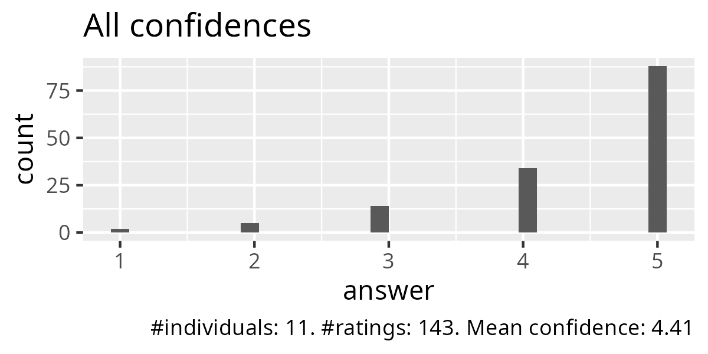
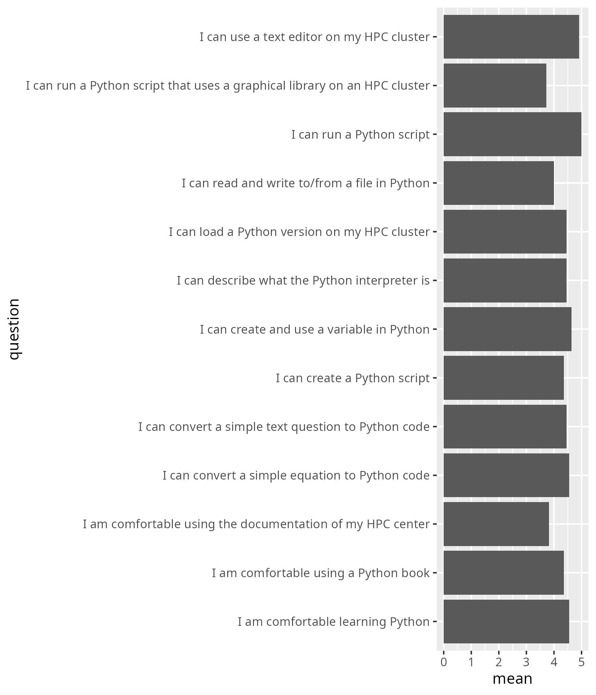
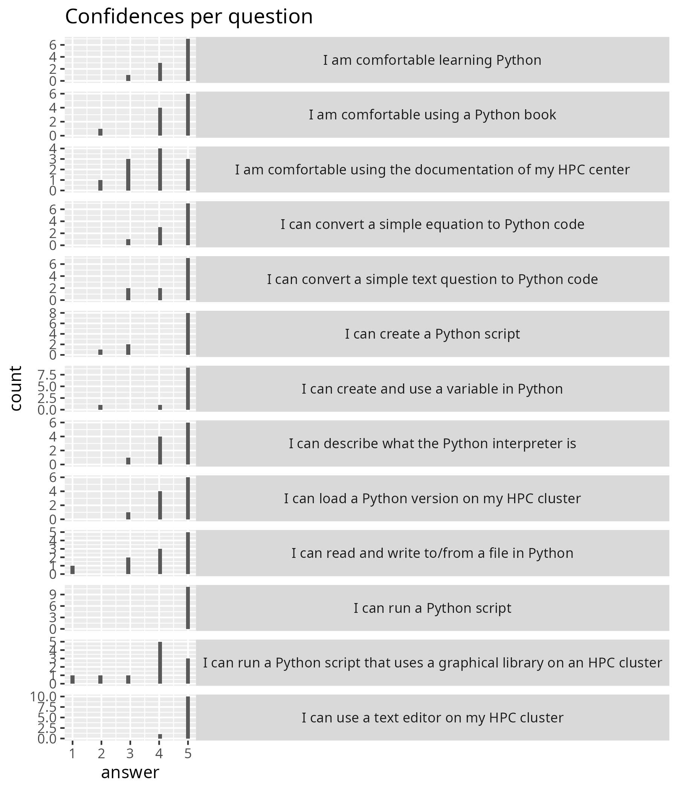
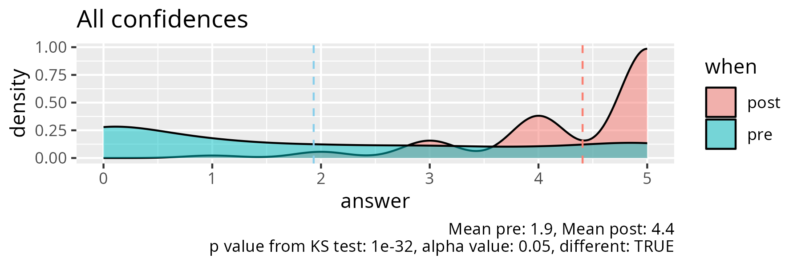
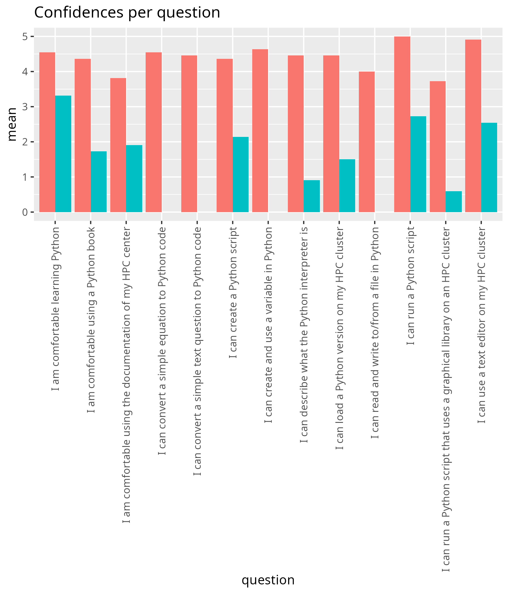
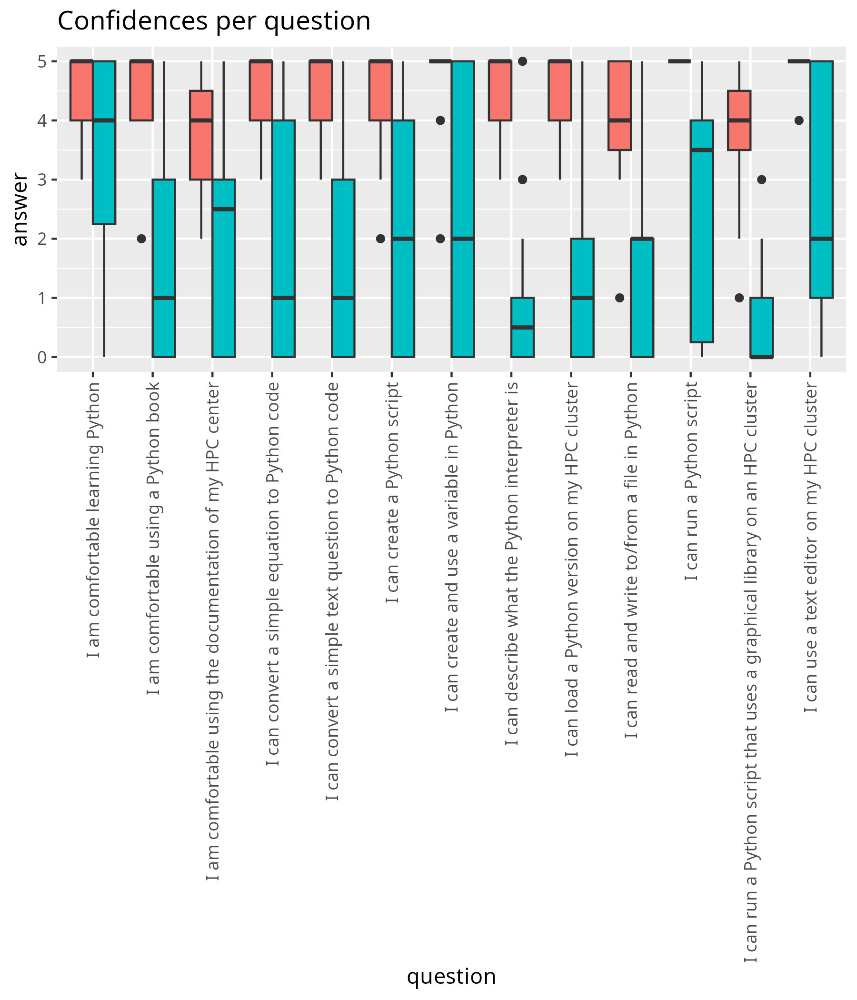
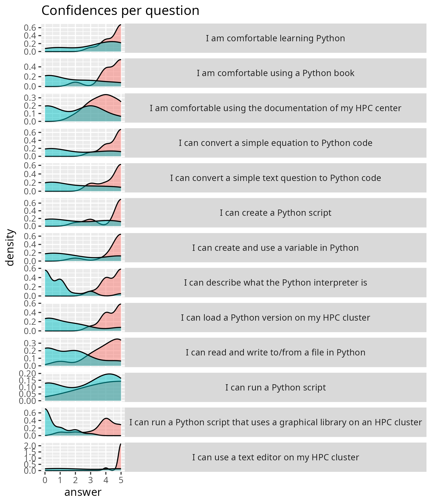

# 2026-03-03

- [Lesson plan](../../lesson_plans/20260303/README.md)
- [Evaluation](../../evaluations/20260303/README.md)
- [Reflection](../../reflections/20260303/README.md)
- Number of non-duplicate registrations: 57
- Number of cancellations: 2
- Number of active participants, whole day: 19 (33%)
- Number of active participants, either half-day: 13
  (some learners attended 1 half-day only) (23%)
- Number of evaluations: 11 (84% fill-in rate by those at the second half-day)

## Results

- [anonymous_feedback.txt](anonymous_feedback.txt)
- [survey_start.csv](survey_start.csv)
- [survey_end.csv](survey_end.csv)
- [survey_end_text_question.txt](survey_end_text_question.txt)
- [success_score.txt](success_score.txt): 95%

## Feedback

From [any_feedback.csv](any_feedback.csv):

- Walking us through the course and asking questions at the beginning helps a lot with anxiety and breaking the ice. Sets a great tone for the rest of the course.  "
- Very slow course on very basic Python on HPC, good as a first course."
- Nice Python Introduction course. Richel is a great teacher who puts a lot of efforts to improve it and to explain the topics clearly to us learners. Thanks!"

From [survey_end.csv](survey_end.csv):

- Maybe the course can also include some practices on how to load additional packages necessary to run advanced python codes in the HPC environment. The current practices have touched upon this issue a little but no systematic introduction.
- Great course, especially the HPC intro. A great way to lower the threshold of using HCP clusters.
- Great course! It was exactly the right amount of content. I liked that the teacher asked questions to everybody and that he also made sure you could feel comfortable with saying "I don't know". Normally I would feel more scared of getting hit with questions at random times. But it kept me on my toes so I didn't start doing something else on my computer while the teacher was talking.
- This course, taught by Richèl Bilderbeek, was a great intro for using python on HPC. It made it easier to understand and more approachable for future learning. Very enjoyable course, enough attention was given to gaining understanding and answering questions!
- Documentation on PDC (Dardel) was not very helpful, sometimes even misleading that took extra time to solve the problem. Some statements above got lower score because it was a bit slow for me to go through the respective topics, or I did not reach the respective topic at all (e.g. reading/writing to/from file). I plan to go through the moments by my own later on. Otherwise the course is very useful, and Richel is a great teacher who puts a lot of efforts to improve it and to explain the topics to us learners. Thanks!
- I appreciate how well organized the course was, both in terms of content and in terms of schedule. Great teaching, it was particularly accommodating of different technical and personal needs/learning styles!

## Analysis, only end

- script used: [analyse.R](analyse.R)
- [average_confidences.csv](average_confidences.csv)
- [success_score.txt](success_score.txt)

## Analysis, pre and post

- [analyse_pre_post.R](analyse_pre_post.R)
- [stats.txt](stats.txt)

<!-- markdownlint-disable MD013 --><!-- Tables cannot be split up over lines, hence will break 80 characters per line -->

|question                                                                  |  mean_pre| mean_post|   p_value|different |
|:-------------------------------------------------------------------------|---------:|---------:|---------:|:---------|
|I am comfortable using the documentation of my HPC center                 | 1.9090909|  3.818182| 0.0031696|TRUE      |
|I am comfortable using a Python book                                      | 1.7272727|  4.363636| 0.0005379|TRUE      |
|I am comfortable learning Python                                          | 3.3181818|  4.545454| 0.0383094|TRUE      |
|I can load a Python version on my HPC cluster                             | 1.5000000|  4.454546| 0.0001888|TRUE      |
|I can describe what the Python interpreter is                             | 0.9090909|  4.454546| 0.0000115|TRUE      |
|I can use a text editor on my HPC cluster                                 | 2.5454545|  4.909091| 0.0024051|TRUE      |
|I can create a Python script                                              | 2.1363636|  4.363636| 0.0014837|TRUE      |
|I can run a Python script                                                 | 2.7272727|  5.000000| 0.0001457|TRUE      |
|I can run a Python script that uses a graphical library on an HPC cluster | 0.5909091|  3.727273| 0.0000085|TRUE      |
|I can create and use a variable in Python                                 | 2.1428571|  4.636364| 0.0021987|TRUE      |
|I can convert a simple equation to Python code                            | 2.0952381|  4.545454| 0.0017489|TRUE      |
|I can convert a simple text question to Python code                       | 1.9047619|  4.454546| 0.0006851|TRUE      |
|I can read and write to/from a file in Python                             | 1.6190476|  4.000000| 0.0008541|TRUE      |

<!-- markdownlint-enable MD013 -->

