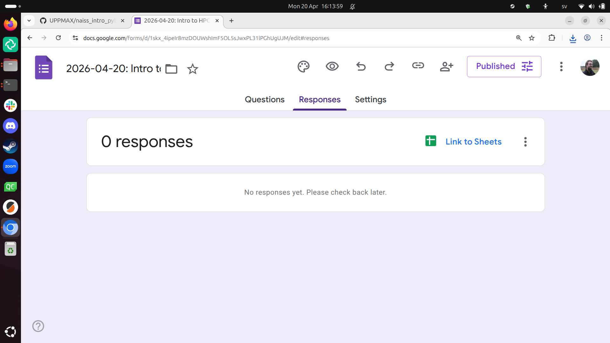
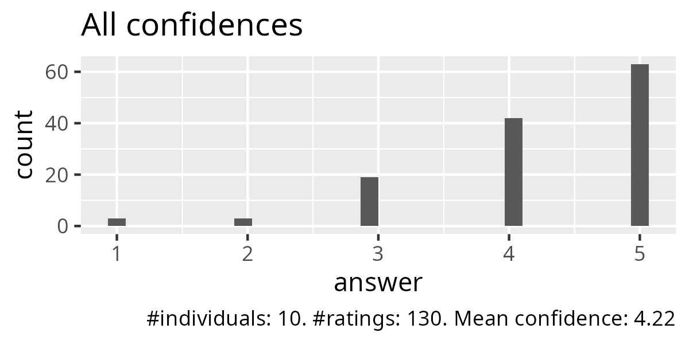
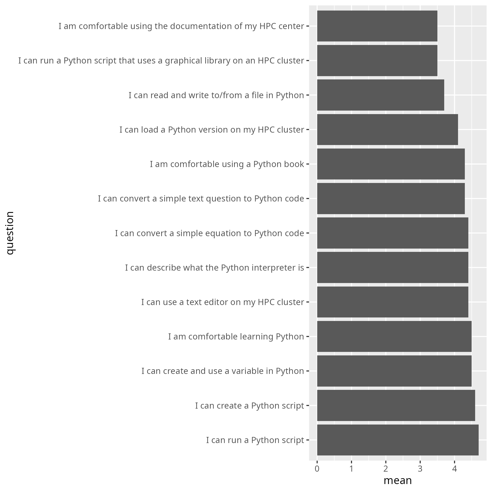
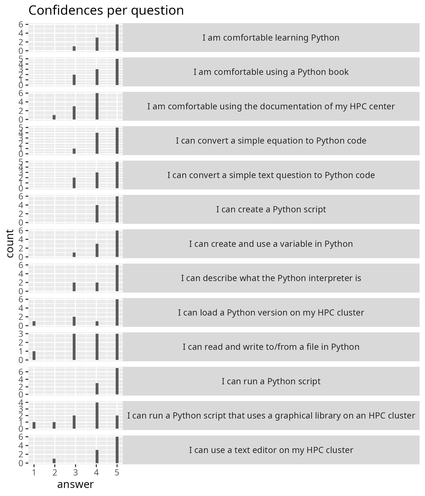
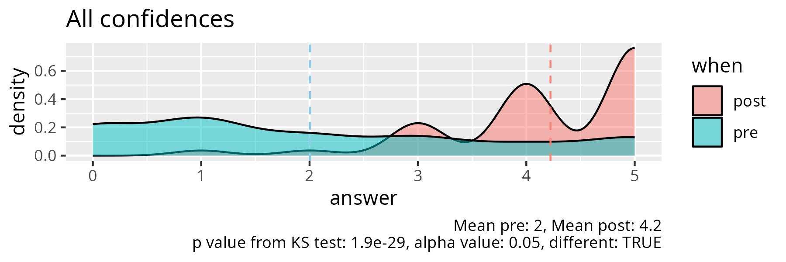
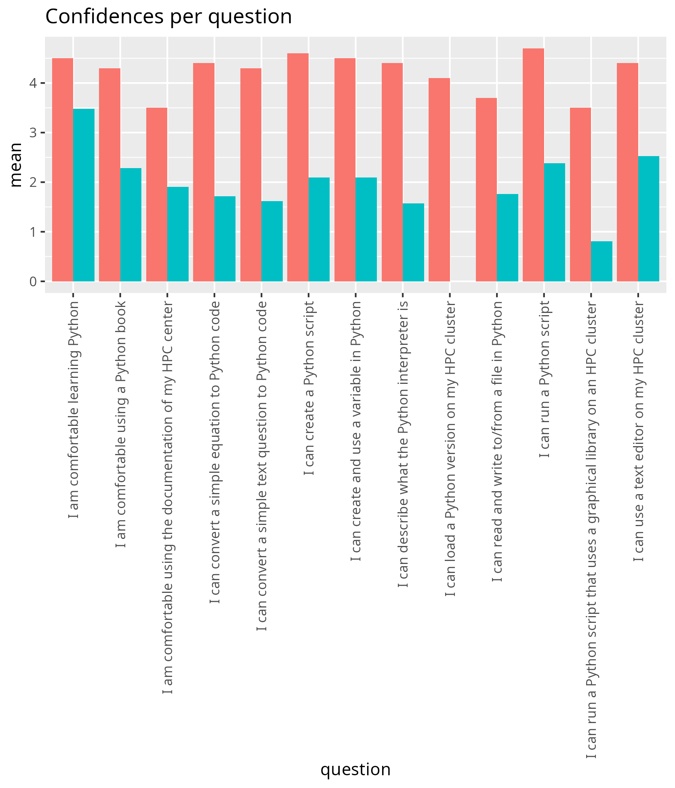
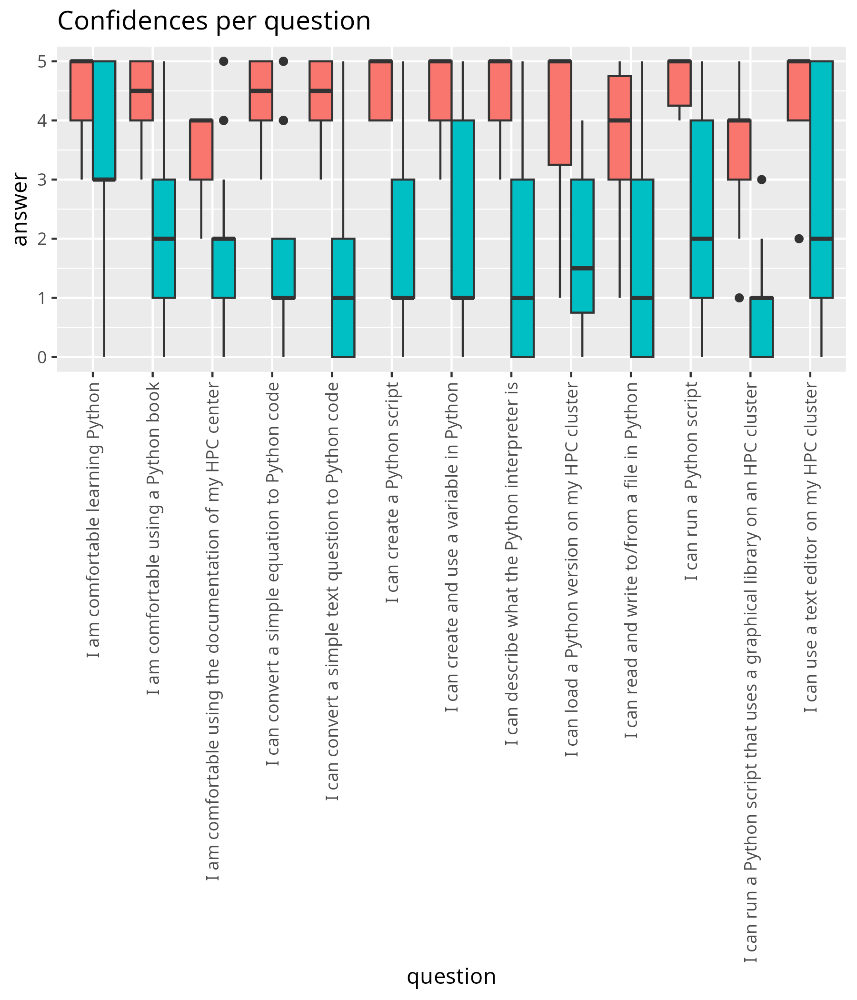
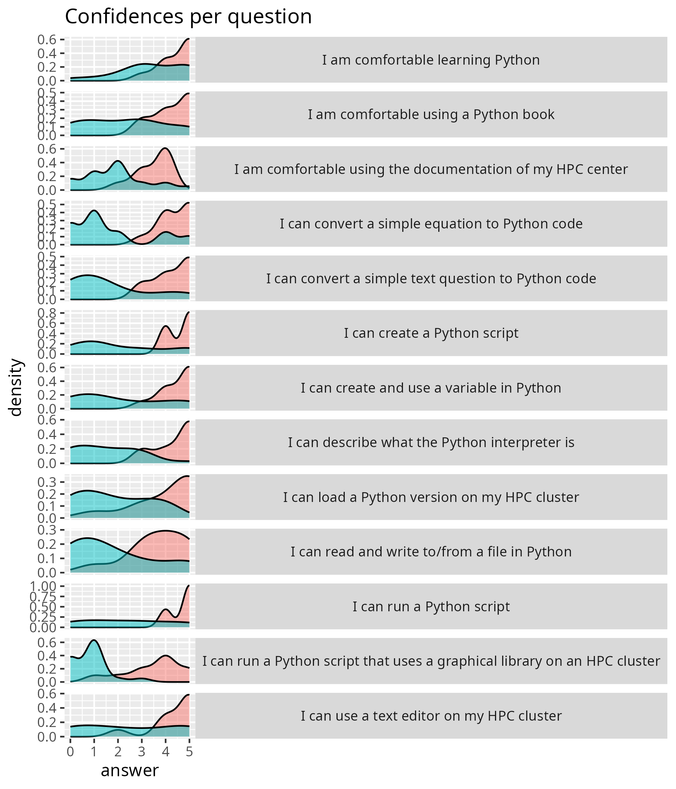

# Evaluation

- Date: 2026-04-20
- As part of the HPC Python course
- [Lesson plan](../../lesson_plans/20260420/README.md)
- [Evaluation](../../evaluations/20260420/README.md)
- [Reflection](../../reflections/20260420/README.md)
- Number of non-duplicate registrations: 50
- Number of active participants, morning: 19 (38%)
- Number of active participants, afternoon: 8 (16%)
- Number of evaluations: 10
  (125% fill-in rate by those that attended the whole day)

## Results

- [survey_start.csv](survey_start.csv)
- [survey_end.csv](survey_end.csv)
- [survey_end_text_question.txt](survey_end_text_question.txt)
- [success_score.txt](success_score.txt): 84%

## Feedback

No feedback here.

From [survey_end_text_question.txt](survey_end_text_question.txt):

- Great course, thanks!
- Very good and concise yet cheerful and helpful teaching.
- All good I think, I like the pace
- Great experience! I needed some time to catch up,
  but it was good to practice. I believe that I can learn Python! Thank You
- The first day of the Python course was really good.
  Richèl is a great teacher and made the course very enjoyable.
  I really appreciated that he provided the Python textbook,
  which was very helpful for learning more and completing the exercises.

## Analysis, only end

- script used: [analyse.R](analyse.R)
- [average_confidences.csv](average_confidences.csv)
- [success_score.txt](success_score.txt)

## Analysis, pre and post

- [analyse_pre_post.R](analyse_pre_post.R)
- [stats.txt](stats.txt)

<!-- markdownlint-disable MD013 --><!-- Tables cannot be split up over lines, hence will break 80 characters per line -->

|question                                                                  |  mean_pre| mean_post|   p_value|different |
|:-------------------------------------------------------------------------|---------:|---------:|---------:|:---------|
|I am comfortable using the documentation of my HPC center                 | 1.9047619|       3.5| 0.0019357|TRUE      |
|I am comfortable using a Python book                                      | 2.2857143|       4.3| 0.0025742|TRUE      |
|I am comfortable learning Python                                          | 3.4761905|       4.5| 0.0477565|TRUE      |
|I can load a Python version on my HPC cluster                             | 1.8000000|       4.1| 0.0009491|TRUE      |
|I can describe what the Python interpreter is                             | 1.5714286|       4.4| 0.0000686|TRUE      |
|I can use a text editor on my HPC cluster                                 | 2.5238095|       4.4| 0.0180472|TRUE      |
|I can create a Python script                                              | 2.0952381|       4.6| 0.0012261|TRUE      |
|I can run a Python script                                                 | 2.3809524|       4.7| 0.0010292|TRUE      |
|I can run a Python script that uses a graphical library on an HPC cluster | 0.8095238|       3.5| 0.0000319|TRUE      |
|I can create and use a variable in Python                                 | 2.0952381|       4.5| 0.0022462|TRUE      |
|I can convert a simple equation to Python code                            | 1.7142857|       4.4| 0.0005018|TRUE      |
|I can convert a simple text question to Python code                       | 1.6190476|       4.3| 0.0004542|TRUE      |
|I can read and write to/from a file in Python                             | 1.7619048|       3.7| 0.0072581|TRUE      |

<!-- markdownlint-enable MD013 -->
