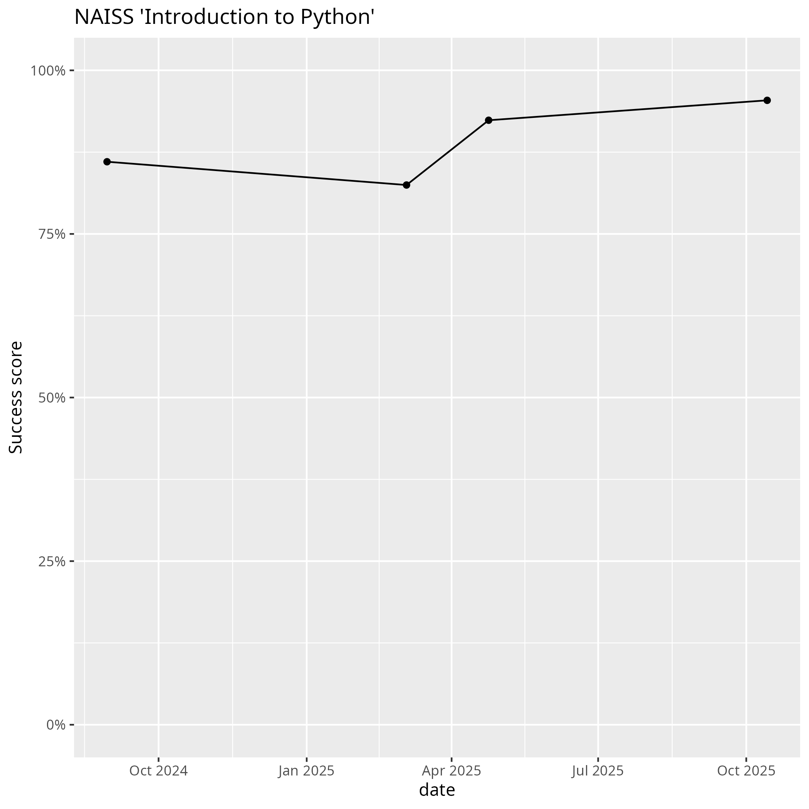

---
tags:
  - evaluations
---

# Evaluations

???- question "Where can I evaluate this course?"

    Go to [evaluation](../evaluation.md) (singular) :-)

Here are the evaluation results of this course:

No |Date      |Evaluations                     |Success score
---|----------|--------------------------------|-------------
1  |2024-01-18|[Evaluation](20240118/README.md)|None measured
2  |2024-08-30|[Evaluation](20240830/README.md)|[86%](20240830/success_score.txt)
3  |2025-03-04|[Evaluation](20250304/README.md)|[82%](20250304/success_score.txt)
4  |2025-04-24|[Evaluation](20250424/README.md)|[92%](20250424/success_score.txt)
5  |2025-10-14|[Evaluation](20251014/README.md)|[95%](20251014/success_score.txt)
6  |2025-11-27|[Evaluation](20251127/README.md)|.

- The 'Success score' is the average confidence the learners
  have on each of the learning outcomes of the course

