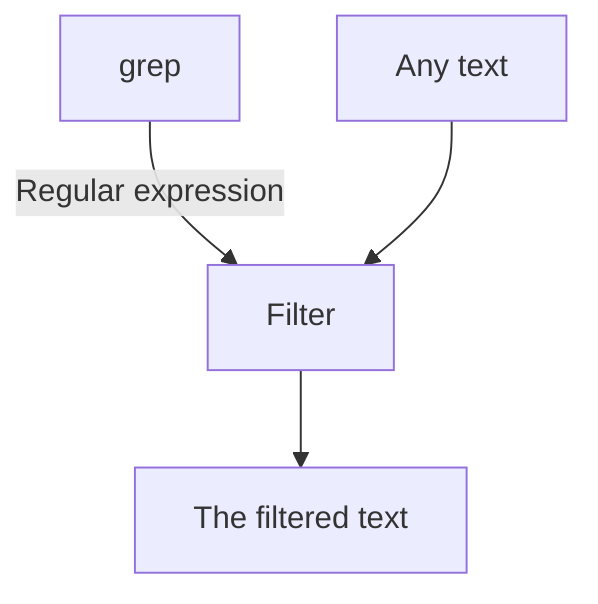

---
tags:
  - test
  - mermaid
---

# `mermaid` tests

This page is to test if `mermaid` works.

## Gantt chart

```mermaid
gantt
  title Lesson plan
  dateFormat X
  axisFormat %s
  Prior : prior, 0, 10s
  Present: present, after prior, 5s
  Challenge: crit, challenge, after present, 20s
  Feedback: feedback, after challenge, 10s
```

## Flow chart

```mermaid
flowchart TD

  complete_text[Any text]
  grep
  filter[Filter]
  filtered_text[The filtered text]

  grep --> |Regular expression| filter
  complete_text --> filter --> filtered_text
```
