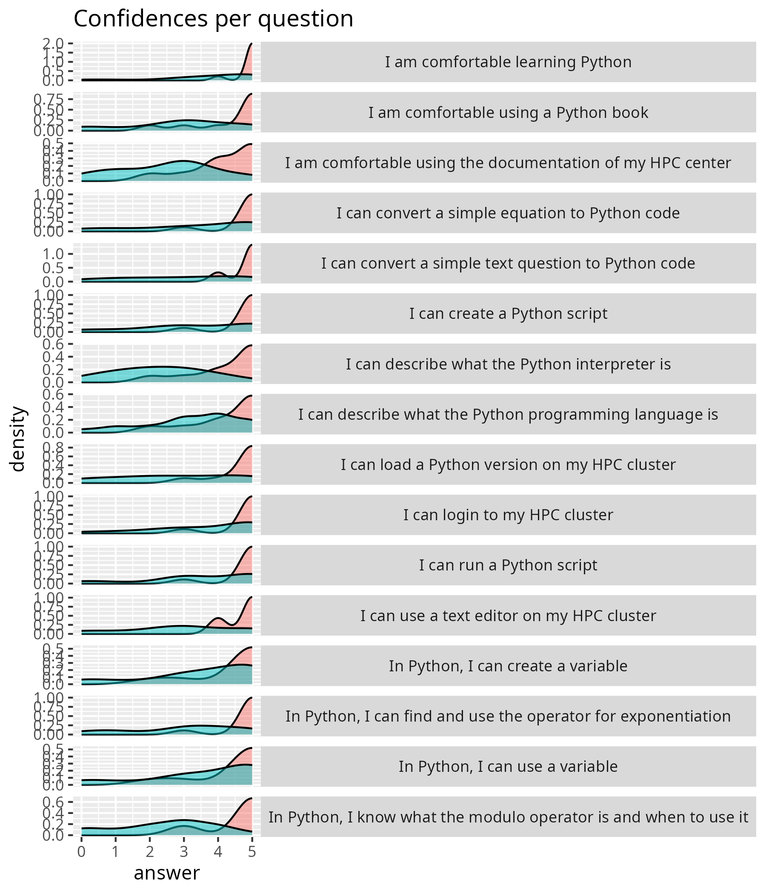

# Reflection

- [Lesson plan](../../lesson_plans/20250424/README.md)
- [Evaluation results](../../evaluations/20250424/README.md)
- [Reflection](../../reflections/20250424/README.md)

## Reflection before looking at evaluation results

I enjoyed working with this group. It was a high pace.
We were productive. We even had some fun.

I had one colleague that I said to treat as a regular learner, but I
failed: I did treat him like something between TA and learner.
At the end of the day (see below), we discussed this. We
both failed and agreed: I treated him as an in-between learner-and-TA,
and he behaved as an in-between learner-and-TA. We also agreed
that this was the right call.

I missed being helped the first hour, although there were some colleagues
available. I did not ask for help, because I felt I had talked too much:
it was at 9:17 that we started doing exercises. At 9:17,
I could have set them to work, but I did not feel the need either.
Next time, encourage them to be absent. Sure, they are
always welcome, but I will manage :-)

- [ ] Encourage colleagues to be absent

One group of 3 ended up in, indeed,
2 people being active and 1 being passive.
I **have** seen this. So I looked for a group
that the passive learner would fit into, but could not
find such a group. One reason is that I did not know
which HPC cluster the learner used.

- [ ] Let learners add the cluster name to their Zoom name,
  else write it down

I cannot keep up a full day. And I think that helps us understand
what the learners feel. But, I did feel uncomfortable with
my later material

- [ ] Make the later material Good

I let them go earlier, as this was the fastest group ever.

- [ ] Add more material, see below

I should add more HPC, i.e. using Python package modules: the course
felt too Python-heavy. I am not against being Python-heavy,
but the course is called 'NAISS Intro to Python', implying
the use for HPC.

- [ ] Show better when HPC is done and Python-only starts

For the material, I feel I should add if-statements and for-loops:
those are more basic concepts.
Also, I feel I should remove function, as this is beyond the scope of
the Python in this course (i.e. 'Be able to write simple Python scripts').

- [ ] Add 'Be able to write simple Python scripts' as the goal
  of the Python-only part

I had the idea to, for next time, add the HPC cluster name behind everyone's
name, e.g. `Richel (Rackham)`. I already (the day after) did
this: learners can change their name themselves.

- [ ] Let the learners change their name to add their HPC
  cluster

- [ ] Add Python package modules

## Feedback Linus

- What went well?
    - All students went through all of the important things
        - RB: definitely!
    - Sending more advanced Python students home was a good thing;
      they came there for the HPC part
        - RB: agree
    - Exercises and material is very good

- What are features of the course?

    - Some learners get lost in the book (it's a good book),
      doing exercises on their own

- What could be improved?

    - Students that already know Python could be sent back home earlier
        - RB: agree, at 11:00 we could let the first people go :-)
    - Some learners do the exercises in the book and then forget about
      the course material.
        - RB: agree: remove the mention of the exercises in the book
          and sent them to the exercises in the course material (only)

## Evaluation results

- [stats.md](../../evaluations/20250424/stats.md)

Conclusions:

- From statistics: assume variables are understood well enough
- From confidences: spend a bit more time on text editors
