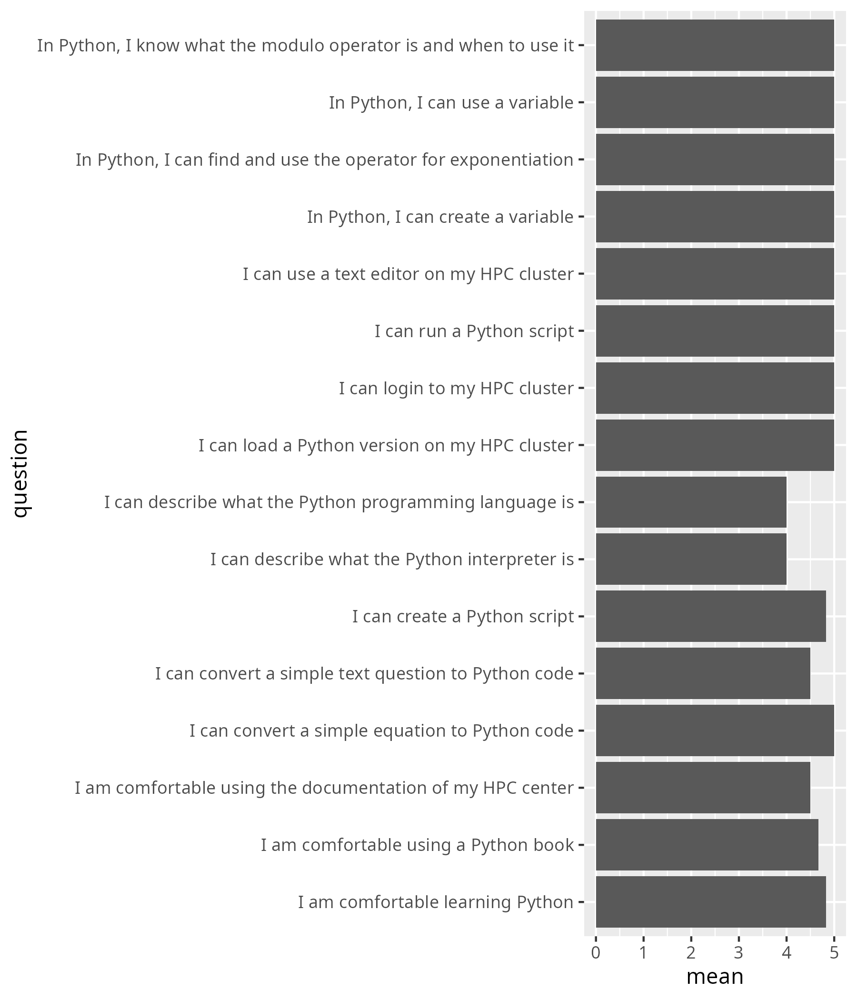

# 2025-10-14

- [Lesson plan](../../lesson_plans/20251014/README.md)
- [Evaluation](../../evaluations/20251014/README.md)
- [Reflection](../../reflections/20251014/README.md)

## Before teaching

The 'Hello little turtles' session took me too much time to get
to get to work. After one hour, I think it is better if this
session starts in a remote desktop environment (ignoring X forwarding).

- [ ] Schedule at 4 hours to fix 'Hello little turtles'
- [ ] Consider to do so for 'Graphics' instead
- [ ] Add one of these to the morning sessions schedule
- [ ] Update goal: to be able to run a Python script on an HPC cluster,
  that runs a graphical library

## Morning session

I clearly marked the two different parts of the day.
This part had a clear end goal: to be able to run a Python
script on an HPC cluster.

I did feel there were too many Priors in it.

- [x] Remove the parts about the 3 types of bugs

With a clear end goal in mind, I sent the faster workers back earlier.

- [ ] Make more explicit: when done, we go home. When working together,
  we will go home sooner

I enjoyed working with this group.

## Afternoon session

This session had a goal, but it could have been
clearer: to be able to read/write a variable from/to a file.

- [ ] Make goal of second half clearer:
  to be able to read/write a variable from/to a file

Also, the session was too cut up.

- [ ] Merge sessions 'Variables, expressions and statements'
  into 1 page

Also, there were useless intermediate goals.

- [x] Remove useless intermediate goals

Also, there were mentions of HPC cluster doc.

- [x] Remove needless mentions of HPC cluster doc in the LOs

Also, TOCs of pages were too deep: make exercises of type header 2.

- [x] make exercises of type header 2

In this part of the day, I sent learners back home earlier.
It felt OK.

I enjoyed working with this group, including the new additions:
they blended in well.

The end of my day was weak: I was mentally exhausted.

## Learning outcomes

- [x] Remove 'I can login to my HPC cluster' as this is a prerequisite

- [x] Remove 'I can describe what the Python programming language is',
  as this is untested

<!-- markdownlint-disable MD013 --><!-- Tables cannot be split up over lines, hence will break 80 characters per line -->

|question                                                         | mean_pre| mean_post|   p_value|different |
|:----------------------------------------------------------------|--------:|---------:|---------:|:---------|
|I am comfortable using the documentation of my HPC center        | 2.727273|  4.500000| 0.0099316|TRUE      |
|I am comfortable using a Python book                             | 2.181818|  4.666667| 0.0048339|TRUE      |
|I am comfortable learning Python                                 | 3.272727|  4.833333| 0.0039403|TRUE      |
|I can login to my HPC cluster                                    | 4.000000|  5.000000| 0.0197055|TRUE      |
|I can load a Python version on my HPC cluster                    | 2.818182|  5.000000| 0.0045775|TRUE      |
|I can describe what the Python programming language is           | 2.181818|  4.000000| 0.0268995|TRUE      |
|I can describe what the Python interpreter is                    | 1.636364|  4.000000| 0.0065500|TRUE      |
|I can use a text editor on my HPC cluster                        | 2.909091|  5.000000| 0.0046626|TRUE      |
|I can create a Python script                                     | 2.090909|  4.833333| 0.0074328|TRUE      |
|I can run a Python script                                        | 2.636364|  5.000000| 0.0045213|TRUE      |
|In Python, I can create a variable                               | 2.000000|  5.000000| 0.0046912|TRUE      |
|In Python, I can use a variable                                  | 2.000000|  5.000000| 0.0019569|TRUE      |
|I can convert a simple equation to Python code                   | 1.909091|  5.000000| 0.0019982|TRUE      |
|In Python, I can find and use the operator for exponentiation    | 1.272727|  5.000000| 0.0016461|TRUE      |
|In Python, I know what the modulo operator is and when to use it | 1.181818|  5.000000| 0.0016461|TRUE      |
|I can convert a simple text question to Python code              | 1.181818|  4.500000| 0.0011858|TRUE      |

<!-- markdownlint-enable MD013 -->

Blimey, all things went up significantly!

## Feedback

- Very well designed and beginner friendly training!
- A very nice basic Python course for beginners
  who want to start using Python on HPC.
  The course website is very informative and tidy. Thanks a lot!
- On the whole I feel the course was good, just not on the right level for me.
  However, the materials for the 4-day course
  (<https://uppmax.github.io/HPC-python/index.html>)
  led me to some more advanced stuff: automatic code optimization with Numba,
  and indirectly to automatic parallelization with DECO.

Agree: it is a beginners course. It should be made more explicit:

- [ ] Put in non-goals: 'do complex Python'
- [ ] Refer to HPC Python course more

- Very nice course for the Python beginner!
- Great course, beginner-friendly!
- Overall, it was a good course for complete beginners.
  However, it would have been nicer to have more discussion
  and less independent reading.
  Much of the material from the Python book could have been replaced
  by direct (faster) explanations from the instructor,
  followed by group discussions and more strictly collaborative exercises.
  This approach would likely have led to faster and more effective learning.

I am happy to hear a fellow teacher here. I am unsure if this is true,
as reading is active learning, where listening is not. Sure, a discussion
is active too and we indeed did not have many. Making the exercises
'strictly collaborative' seems like an interesting idea.

All in all: I wish I could talk with him/her about this.

- [ ] Think on how to implement this

- Since there are already plenty of Python tutorials available online,
  a course like this should focus on being more interactive rather
  than being a space where to work independently through existing materials.
  I also would have appreciated covering some more essential
  yet slightly advanced topics—such as functions, available python packages,
  and similar concepts—instead of spending as much time on very basic material,
  like simple arithmetic with operators.

Another fellow teacher! Also here: make the exercises more collaborative.
I also see some ideas here, such as using the book to write simple programs.
Also here: I wish I could talk with him/her about this.

- [ ] Think on how to implement to make exercises more collaborative,
  e.g. let them write their own code (as a group) based on the book?

Fun!

## Conclusion

The course was appreciated as a beginner course and criticized for being to
non-collaborative. I agree that there is room for improvement there!

I would rate my own teaching a 7 out of 10, as the end was weak.

