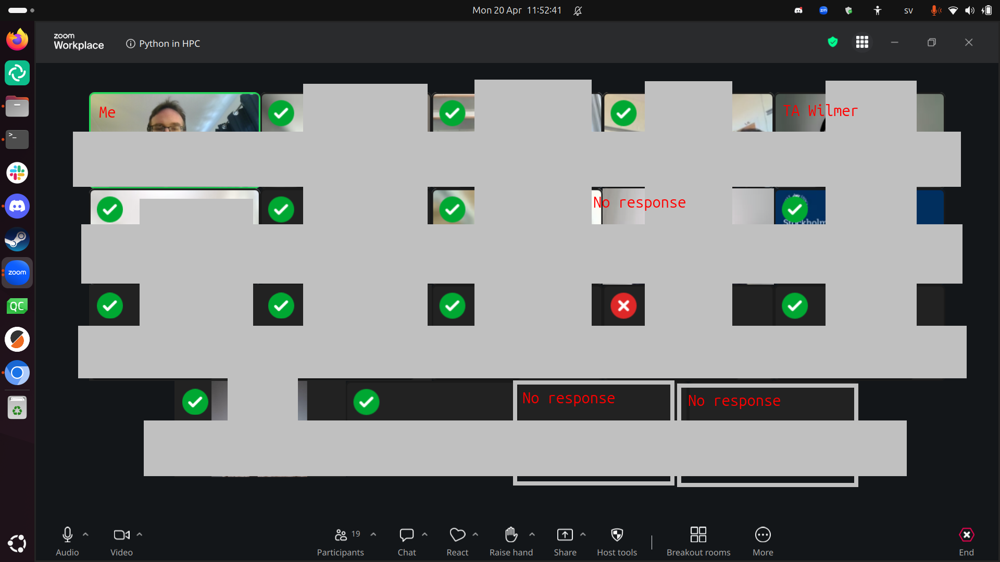

# Reflection

- Date: 2026-04-20
- [Lesson plan](../../lesson_plans/20260420/README.md)
- [Evaluation](../../evaluations/20260420/README.md)
- [Reflection](../../reflections/20260420/README.md)
- [Chat](meeting_saved_new_chat.txt)

## Halfway during teaching

The morning felt sluggish.

I was worried about the new Zoom update
causing problems. That **worry** was what caused part of the problem.
The clearest example was when I opened the breakout rooms.
I *intended* to allow learners to move around freely.
However, it behaved differently. The observer stated that I may have
clicked the wrong thing. I felt confident I did the right thing and felt it
was likelier that Zoom was the problem. Turned out: she was right. When
I felt it was likelier **I** was the cause (with help from the
input from the observer), then suddenly I was able to fix the problem.
It was painful, though, to move all the learners into their
own breakout rooms.

I did prepare with the new Zoom update, on Friday (with my teaching
assistant), on Sunday (with a random person) and this morning
again  (with my teaching
assistant). Still, it was my worry that made me draw a wrong
conclusion initially.

The new Zoom interface, however, is definitely more sluggish
and less snappy when scrolling though breakout rooms. And with 20 breakout
rooms in use, this made my jumping around way slower than usually.

With the sluggish Zoom, I need help for groups of this size.

- [ ] Ask help for each 20 registrations. Train the helpers,
  using, for example
  [my material on 'Duos in breakout rooms'](https://richelbilderbeek.github.io/teaching/exercise_procedures/duos_in_breakout_rooms/)

Due to the sluggish Zoom (more reasons will follow below),
it took the first two hours to do session 1 (out of 3):
'Using the Python interpreter'. I did round it off with a proper Feedback
at 10:45. I regret that my observer already had left (I was aware, my
course just went unexpectedly sluggish), as it will not help me answer
my observation question. I informed her of my regrets. I hope she
has seen something that was interesting to her. She will be back
later that day, let's hope that there is a proper Feedback then.

In the third hour, I properly introduced the second session, with a proper
Feedback at the end.

I measured if I achieved my teaching goal 'Have you been able to run
a Python script on your HPC cluster?':

- 13x: Yes
- 1x: No (a Dardel user)
- 3x: No response. However, I know: 1x was done (he just has Zoom problems)
  and 1x away (he notified us). Only once I think
  this *may* have been a 'no'

When assuming the worst, (15 out of 17 is) 88% of my learners have achieved
the goals of the morning session. I am unhappy with this. I hope this
can be fixed in the afternoon.

Another reason things were sluggish: at least 5 learners had not done
the prerequisites. I wish we could put the link to the Zoom room on the
HPC clusters, so that we only get learners that actually have done
the prerequisites. As this plan is likely to be voted against
by the teacher team, the solution that actually worked is to have
a dedicated teaching assistant for just this problem. In all
previous course iterations, my colleague Pavlin fulfilled
this role. Today it was made clear once again how important he is
to the smooth proceedings of this course.

- [ ] Suggest to put the Zoom URL on an HPC cluster, else
- [ ] Book a helper (e.g. Pavlin) for login problems

Another reason the course went sluggish:
the documentation of some centers is incomplete.
There were 2 learners that complained about the Dardel documentation,
and 1 about the COSMOS documentation.

My intern was a great help! I have not been able to check him,
but I do know him a bit. I know we has helped some learners with their
problems successfully. And I have trained him the working day before.

In the end of the morning, I have been able to speak with all learners
1-on-1 at least once. Even though I wish I would have had more contact with
them, this course iteration did not work well enough for that.

## After teaching

The afternoon went super smooth. There were 8 learners, that knew how
I work and no longer had technical problems anymore: it was smooth sailing.

In the end, I conclude that these were the reasons for the sluggishness,
with the most important first:

- The disruption of learners not having done the prerequisites
  **and** no dedicated teaching assistant for helping these
- Zoom responding slower
- Me not trusting Zoom (only the first two hours)

## Evaluation results

[The anonymous feedback for the whole day](../../evaluations/20260420/survey_end_text_question.txt):

- Great course, thanks!

:-)

- Very good and concise yet cheerful and helpful teaching.

I am happy that my conciseness is appreciated.

- All good I think, I like the pace

I am happy that following the pace of the learners is appreciated.

- Great experience! I needed some time to catch up,
  but it was good to practice. I believe that I can learn Python! Thank You

I am happy that I could take the time to let this learner catch up.
The course goal has been achieved :-)

- The first day of the Python course was really good.
  Richèl is a great teacher and made the course very enjoyable.
  I really appreciated that he provided the Python textbook,
  which was very helpful for learning more and completing the exercises.

I am happy this learner enjoyed this day and the book.

[Success score](../../evaluations/20260420/success_score.txt): 84%

Let's go through the lowest rated ones:

- 'I am comfortable using the documentation of my HPC center',
  with an average confidence of 3.5: this is something that I cannot fix myself.
  HPC centers vary in the quality of their documentation.
  And worse: some do not even allow one/me to help improve it
- 'I can run a Python script that uses a graphical library on an HPC cluster',
  with an average confidence of 3.5:
  this seems right, as we did not discuss this and, hence, only the faster
  learners were able to do this.
- 'I can read and write to/from a file in Python'
  with an average confidence of 3.7:
  this seems right, as we did not discuss this and, hence, only the faster
  learners were able to do this.

Did I make a significant difference?

<!-- markdownlint-disable MD013 --><!-- Tables cannot be split up over lines, hence will break 80 characters per line -->

|question                                                                  |  mean_pre| mean_post|   p_value|different |
|:-------------------------------------------------------------------------|---------:|---------:|---------:|:---------|
|I am comfortable using the documentation of my HPC center                 | 1.9047619|       3.5| 0.0019357|TRUE      |
|I am comfortable using a Python book                                      | 2.2857143|       4.3| 0.0025742|TRUE      |
|I am comfortable learning Python                                          | 3.4761905|       4.5| 0.0477565|TRUE      |
|I can load a Python version on my HPC cluster                             | 1.8000000|       4.1| 0.0009491|TRUE      |
|I can describe what the Python interpreter is                             | 1.5714286|       4.4| 0.0000686|TRUE      |
|I can use a text editor on my HPC cluster                                 | 2.5238095|       4.4| 0.0180472|TRUE      |
|I can create a Python script                                              | 2.0952381|       4.6| 0.0012261|TRUE      |
|I can run a Python script                                                 | 2.3809524|       4.7| 0.0010292|TRUE      |
|I can run a Python script that uses a graphical library on an HPC cluster | 0.8095238|       3.5| 0.0000319|TRUE      |
|I can create and use a variable in Python                                 | 2.0952381|       4.5| 0.0022462|TRUE      |
|I can convert a simple equation to Python code                            | 1.7142857|       4.4| 0.0005018|TRUE      |
|I can convert a simple text question to Python code                       | 1.6190476|       4.3| 0.0004542|TRUE      |
|I can read and write to/from a file in Python                             | 1.7619048|       3.7| 0.0072581|TRUE      |

<!-- markdownlint-enable MD013 -->

