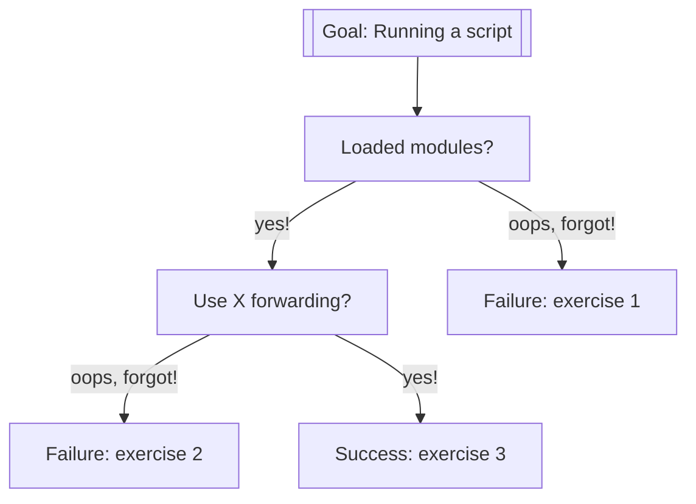

# Hello, little turtles

!!! warning "Not happy about this"

    I am unhappy about this session.

    Instead:

    - Start from a remote desktop environment
    - Ignore X forwarding

!!!- info "Learning outcomes"

    - Practice using the documentation of your HPC cluster
    - Practice using the Python book
      [How to Think Like a Computer Scientist: Learning with Python 3](https://openbookproject.net/thinkcs/python/english3e/index.html)
    - Have a first 'Get stuff to work' experience
    - Rehearse creating a script
    - Experience when importing a Python package gives an error
    - Search for a module that needs to be loaded
    - Import a Python package successfully

???- question "For teachers"

    Teaching goals are:

    - Learners have observed the error when importing a Python package
      without the needed module loaded
    - Learners have searched through the modules of their HPC cluster
    - Learners may find out that X-forwarding is important
    - Learners have gotten 'stuff to work'

    Other goals are:

    - Verify that learners indeed have learned how to login with X-forwarding.
      Redirect to remote desktop environment as a solution

    Lesson plan:

    - 5 mins: prior knowledge
    - 5 mins: presentation
    - 25 mins: challenge
    - 5 mins: feedback

    Prior questions:

    - What are features of the Python programming language?
    - What are problems you may face when running someone else's Python code?
    - Trick question: what is a module?
    - Which problem do modules solve?
    - What is a Python module/package?
    - Which problem do Python modules/packages solve?
    - What is X forwarding?

## Overview

Sometimes you need to get 'stuff to work', for example,
code written by someone else.
In this session, we practice this,
going through the problems and errors that occur
when you 'just want to run the stupid code'.



## Exercises

## Exercise 1: run without packages

Read the following sections of
[How to Think Like a Computer Scientist: Learning with Python 3](https://openbookproject.net/thinkcs/python/english3e/index.html):

- 3.1. Our first turtle program

Then:

- Log in to your favorite HPC cluster using SSH **without** X forwarding

???- question "Answer"

    HPC Cluster|Example SSH login command
    -----------|-------------------------------------------------------
    Alvis      |`ssh sven@alvis1.c3se.chalmers.se`
    Bianca     |`ssh sven@bianca.uppmax.uu.se`
    COSMOS     |`ssh sven@cosmos.lunarc.lu.se`
    Dardel     |`ssh -i ~/.ssh/id-ed25519-pdc svensv@dardel.pdc.kth.se`
    Kebnekaise |`ssh sven@kebnekaise.hpc2n.umu.se`
    LUMI       |`ssh -i ~/.ssh/id_rsa_lumi svensson@lumi.csc.fi`
    Pelle      |`ssh pelle@rackham.uppmax.uu.se`
    Rackham    |`ssh sven@rackham.uppmax.uu.se`
    Tetralith  |`ssh x_svesv@tetralith.nsc.liu.se`

- Do **not** load a Python module: it is the point of this exercise
  to see what happens if you forget to do so!

- Copy-paste the first script in that section to a script
  called `my_turtle.py` on your favorite
  HPC cluster.
  Below is a copy of that script:

```python
import turtle             # Allows us to use turtles
wn = turtle.Screen()      # Creates a playground for turtles
alex = turtle.Turtle()    # Create a turtle, assign to alex

alex.forward(50)          # Tell alex to move forward by 50 units
alex.left(90)             # Tell alex to turn by 90 degrees
alex.forward(30)          # Complete the second side of a rectangle

wn.mainloop()             # Wait for user to close window
```

!!! warning "Do not call the script `turtle.py`"

    Do not call the script `turtle.py`.
    Feel encouraged to do so anyways and observe the error message :-)

- Run the script on your HPC cluster using `python`
  **without loading any modules**. 
  Does your HPC cluster have the `turtle` Python package installed
  by default?

???- question "Answer"

    HPC Cluster|Has `turtle` Python package installed by default? 
    -----------|-------------------------------------------------------
    Alvis      |.
    Bianca     |Yes
    COSMOS     |Yes
    Dardel     |No
    Kebnekaise |No
    LUMI       |No
    Pelle      |Yes
    Rackham    |Yes
    Tetralith  |Yes

    Here is the error:

    === "Bianca"

    ```bash
    [richel@sens2025560-bianca ~]$ python my_turtle.py 
    Traceback (most recent call last):
      File "my_turtle.py", line 2, in <module>
        wn = turtle.Screen()      # Creates a playground for turtles
      File "/usr/lib64/python2.7/lib-tk/turtle.py", line 3552, in Screen
        Turtle._screen = _Screen()
      File "/usr/lib64/python2.7/lib-tk/turtle.py", line 3568, in __init__
        _Screen._root = self._root = _Root()
      File "/usr/lib64/python2.7/lib-tk/turtle.py", line 458, in __init__
        TK.Tk.__init__(self)
      File "/usr/lib64/python2.7/lib-tk/Tkinter.py", line 1745, in __init__
        self.tk = _tkinter.create(screenName, baseName, className, interactive, wantobjects, useTk, sync, use)
    _tkinter.TclError: no display name and no $DISPLAY environment variable
    ```

    === "COSMOS"

        ```bash
        [richel@cosmos2 ~]$ python my_turtle.py 
        Traceback (most recent call last):
          File "/home/richel/my_turtle.py", line 2, in <module>
            wn = turtle.Screen()      # Creates a playground for turtles
          File "/usr/lib64/python3.9/turtle.py", line 3664, in Screen
            Turtle._screen = _Screen()
          File "/usr/lib64/python3.9/turtle.py", line 3680, in __init__
            _Screen._root = self._root = _Root()
          File "/usr/lib64/python3.9/turtle.py", line 435, in __init__
            TK.Tk.__init__(self)
          File "/usr/lib64/python3.9/tkinter/__init__.py", line 2270, in __init__
            self.tk = _tkinter.create(screenName, baseName, className, interactive, wantobjects, useTk, sync, use)
        _tkinter.TclError: no display name and no $DISPLAY environment variable
        ```

    === "Dardel"

        ```bash
        richelbi@login1:~> python my_turtle.py 
        Traceback (most recent call last):
          File "my_turtle.py", line 1, in <module>
            import turtle             # Allows us to use turtles
        ImportError: No module named turtle
        ```

    === "Kebnekaise"

        ```bash
        b-an01 [~]$ python my_turtle.py 
        Traceback (most recent call last):
          File "my_turtle.py", line 1, in <module>
            import turtle             # Allows us to use turtles
          File "/usr/lib/python2.7/lib-tk/turtle.py", line 107, in <module>
            import Tkinter as TK
          File "/usr/lib/python2.7/lib-tk/Tkinter.py", line 42, in <module>
            raise ImportError, str(msg) + ', please install the python-tk package'
        ImportError: No module named _tkinter, please install the python-tk package
        ```

    === "LUMI"

        ```bash
        bilderbe@uan04:~> python my_turtle.py 
        -bash: python: command not found
        ```

    === "Pelle"

        ```bash
        [richel@pelle2 ~]$ python my_turtle.py 
        Traceback (most recent call last):
          File "/domus/h1/richel/my_turtle.py", line 2, in <module>
            wn = turtle.Screen()      # Creates a playground for turtles
          File "/usr/lib64/python3.9/turtle.py", line 3664, in Screen
            Turtle._screen = _Screen()
          File "/usr/lib64/python3.9/turtle.py", line 3680, in __init__
            _Screen._root = self._root = _Root()
          File "/usr/lib64/python3.9/turtle.py", line 435, in __init__
            TK.Tk.__init__(self)
          File "/usr/lib64/python3.9/tkinter/__init__.py", line 2270, in __init__
            self.tk = _tkinter.create(screenName, baseName, className, interactive, wantobjects, useTk, sync, use)
        _tkinter.TclError: no display name and no $DISPLAY environment variable
        ```

    === "Rackham"

        ```bash
        [richel@rackham1 ~]$ python my_turtle.py 
        Traceback (most recent call last):
          File "my_turtle.py", line 2, in <module>
            wn = turtle.Screen()      # Creates a playground for turtles
          File "/usr/lib64/python2.7/lib-tk/turtle.py", line 3552, in Screen
            Turtle._screen = _Screen()
          File "/usr/lib64/python2.7/lib-tk/turtle.py", line 3568, in __init__
            _Screen._root = self._root = _Root()
          File "/usr/lib64/python2.7/lib-tk/turtle.py", line 458, in __init__
            TK.Tk.__init__(self)
          File "/usr/lib64/python2.7/lib-tk/Tkinter.py", line 1745, in __init__
            self.tk = _tkinter.create(screenName, baseName, className, interactive, wantobjects, useTk, sync, use)
        _tkinter.TclError: no display name and no $DISPLAY environment variable
        ```

    === "Tetralith"

        ```bash
        [x_ricbi@tetralith3 ~]$ python my_turtle.py 
        Traceback (most recent call last):
          File "/home/x_ricbi/my_turtle.py", line 2, in <module>
            wn = turtle.Screen()      # Creates a playground for turtles
          File "/usr/lib64/python3.9/turtle.py", line 3664, in Screen
            Turtle._screen = _Screen()
          File "/usr/lib64/python3.9/turtle.py", line 3680, in __init__
            _Screen._root = self._root = _Root()
          File "/usr/lib64/python3.9/turtle.py", line 435, in __init__
            TK.Tk.__init__(self)
          File "/usr/lib64/python3.9/tkinter/__init__.py", line 2270, in __init__
            self.tk = _tkinter.create(screenName, baseName, className, interactive, wantobjects, useTk, sync, use)
        _tkinter.TclError: no display name and no $DISPLAY environment variable
        ```

???- question "For those that use MobaXterm that cannot get an error"

    It seems that for some MobaXterm users,
    the X-forwarding is always on,
    so you cannot get this error.

    To get the error: create a new terminal
    and login via `ssh` without the `-X`

- Load the Python software module of the correct version

HPC Cluster|Python version
-----------|--------------
Alvis      |`3.12.3`
Bianca     |`3.11.4`
COSMOS     |`3.11.5`
Dardel     |`3.12.3`
Kebnekaise |`3.11.3`
LUMI       |`3.11.7`
Pelle      |`3.13.1`
Rackham    |`3.12.7`
Tetralith  |`3.10.4`

???- question "Reminder"

    See [Exercise 3 of 'Using the Python interpreter'](using_the_python_interpreter.md#exercise-3-load-the-python-module)

- Run the script on your HPC cluster using `python`
  (now: with the modules loaded).
  What is the error message now?


???- question "Answer"

    HPC Cluster|Will `turtle` work with modules loaded?
    -----------|-------------------------------------------------------
    Alvis      |?
    Bianca     |Never
    COSMOS     |Yes
    Dardel     |TODO
    Kebnekaise |?
    LUMI       |?
    Pelle      |Yes
    Rackham    |Yes
    Tetralith  |Yes

    Here is the error:

    === "Bianca"

    ```bash
    [richel@sens2025560-bianca ~]$ python my_turtle.py 
    Traceback (most recent call last):
      File "my_turtle.py", line 2, in <module>
        wn = turtle.Screen()      # Creates a playground for turtles
      File "/usr/lib64/python2.7/lib-tk/turtle.py", line 3552, in Screen
        Turtle._screen = _Screen()
      File "/usr/lib64/python2.7/lib-tk/turtle.py", line 3568, in __init__
        _Screen._root = self._root = _Root()
      File "/usr/lib64/python2.7/lib-tk/turtle.py", line 458, in __init__
        TK.Tk.__init__(self)
      File "/usr/lib64/python2.7/lib-tk/Tkinter.py", line 1745, in __init__
        self.tk = _tkinter.create(screenName, baseName, className, interactive, wantobjects, useTk, sync, use)
    _tkinter.TclError: no display name and no $DISPLAY environment variable
    ```

    === "COSMOS"

        ```bash
        [richel@cosmos2 ~]$ python my_turtle.py 
        Traceback (most recent call last):
          File "/home/richel/my_turtle.py", line 2, in <module>
            wn = turtle.Screen()      # Creates a playground for turtles
          File "/usr/lib64/python3.9/turtle.py", line 3664, in Screen
            Turtle._screen = _Screen()
          File "/usr/lib64/python3.9/turtle.py", line 3680, in __init__
            _Screen._root = self._root = _Root()
          File "/usr/lib64/python3.9/turtle.py", line 435, in __init__
            TK.Tk.__init__(self)
          File "/usr/lib64/python3.9/tkinter/__init__.py", line 2270, in __init__
            self.tk = _tkinter.create(screenName, baseName, className, interactive, wantobjects, useTk, sync, use)
        _tkinter.TclError: no display name and no $DISPLAY environment variable
        ```

    === "Dardel"

        ```bash
        richelbi@login1:~> python my_turtle.py 
        Traceback (most recent call last):
          File "my_turtle.py", line 1, in <module>
            import turtle             # Allows us to use turtles
        ImportError: No module named turtle
        ```

        To fix:

        ```bash
        richelbi@login1:~> module load miniconda3

        Lmod is automatically replacing "cpeGNU/24.11" with "PrgEnv-gnu/8.6.0".


        Lmod is automatically replacing "cce/18.0.1" with "gcc-native/12.3".


        Lmod is automatically replacing "PrgEnv-cray/8.6.0" with "cpeGNU/24.11".


        Due to MODULEPATH changes, the following have been reloaded:
          1) cray-libsci/24.11.0     2) cray-mpich/8.1.31
        ```

        However, this still fails:

        ```
        richelbi@login1:~> conda install turtle

        EnvironmentNotWritableError: The current user does not have write permissions to the target environment.
          environment location: /pdc/software/24.11/eb/software/miniconda3/25.3.1-1-cpeGNU-24.11
          uid: 3222772
          gid: 3222772
        ```

        TODO

    === "Kebnekaise"

        ```bash
        b-an01 [~]$ python my_turtle.py 
        Traceback (most recent call last):
          File "my_turtle.py", line 1, in <module>
            import turtle             # Allows us to use turtles
          File "/usr/lib/python2.7/lib-tk/turtle.py", line 107, in <module>
            import Tkinter as TK
          File "/usr/lib/python2.7/lib-tk/Tkinter.py", line 42, in <module>
            raise ImportError, str(msg) + ', please install the python-tk package'
        ImportError: No module named _tkinter, please install the python-tk package
        ```

    === "LUMI"

        ```bash
        bilderbe@uan04:~> python my_turtle.py 
        -bash: python: command not found
        ```

    === "Pelle"

        ```bash
        [richel@pelle2 ~]$ python my_turtle.py 
        Traceback (most recent call last):
          File "/domus/h1/richel/my_turtle.py", line 2, in <module>
            wn = turtle.Screen()      # Creates a playground for turtles
          File "/usr/lib64/python3.9/turtle.py", line 3664, in Screen
            Turtle._screen = _Screen()
          File "/usr/lib64/python3.9/turtle.py", line 3680, in __init__
            _Screen._root = self._root = _Root()
          File "/usr/lib64/python3.9/turtle.py", line 435, in __init__
            TK.Tk.__init__(self)
          File "/usr/lib64/python3.9/tkinter/__init__.py", line 2270, in __init__
            self.tk = _tkinter.create(screenName, baseName, className, interactive, wantobjects, useTk, sync, use)
        _tkinter.TclError: no display name and no $DISPLAY environment variable
        ```

    === "Rackham"

        ```bash
        [richel@rackham2 ~]$ python my_little_turtle.py
        Traceback (most recent call last):
          File "/domus/h1/richel/my_little_turtle.py", line 2, in <module>
            wn = turtle.Screen()      # Creates a playground for turtles
          File "/sw/comp/python/3.10.8/rackham/lib/python3.10/turtle.py", line 3664, in Screen
            Turtle._screen = _Screen()
          File "/sw/comp/python/3.10.8/rackham/lib/python3.10/turtle.py", line 3680, in __init__
            _Screen._root = self._root = _Root()
          File "/sw/comp/python/3.10.8/rackham/lib/python3.10/turtle.py", line 435, in __init__
            TK.Tk.__init__(self)
          File "/sw/comp/python/3.10.8/rackham/lib/python3.10/tkinter/__init__.py", line 2299, in __init__
            self.tk = _tkinter.create(screenName, baseName, className, interactive, wantobjects, useTk, sync, use)
        _tkinter.TclError: no display name and no $DISPLAY environment variable
        [richel@rackham2 ~]$
        ```

    === "Tetralith"

        ```bash
        [x_ricbi@tetralith3 ~]$ python my_turtle.py 
        Traceback (most recent call last):
          File "/home/x_ricbi/my_turtle.py", line 2, in <module>
            wn = turtle.Screen()      # Creates a playground for turtles
          File "/usr/lib64/python3.9/turtle.py", line 3664, in Screen
            Turtle._screen = _Screen()
          File "/usr/lib64/python3.9/turtle.py", line 3680, in __init__
            _Screen._root = self._root = _Root()
          File "/usr/lib64/python3.9/turtle.py", line 435, in __init__
            TK.Tk.__init__(self)
          File "/usr/lib64/python3.9/tkinter/__init__.py", line 2270, in __init__
            self.tk = _tkinter.create(screenName, baseName, className, interactive, wantobjects, useTk, sync, use)
        _tkinter.TclError: no display name and no $DISPLAY environment variable
        ```


The error is `no display name and no $DISPLAY environment variable`.
In simpler terms, this can be read as 'Nothing to show graphics with'.

The solution is to login to your HPC cluster with X forwarding enabled.
For sensitive data HPC clusters, this means running a terminal
within a remote desktop environment.

## Exercise 3: Running a first program

Now we try to make this script work!

Read:

- [the UPPMAX documentation 'Loading Python packages'](http://docs.uppmax.uu.se/software/python/#loading-python-packages)
- [the UPPMAX documentation 'Modules'](http://docs.uppmax.uu.se/cluster_guides/modules/)

Now, try to get the script to work.

When running the code, there should be a visible pop-up window. If not,
re-read
[the UPPMAX documentation page 'Login to Rackham'](http://docs.uppmax.uu.se/getting_started/login_rackham/)
and enable X-forwarding. If X-forwarding does not work,
use the Rackham remote desktop environment.

???- question "Need more hints?"

    The exercise is about *practicing* to search for an UPPMAX module,
    hence giving away the answer makes this session useless.

    However, if you feel stuck too much,
    you can watch
    [a video in which this exercise is done](https://youtu.be/bnN-1uzsgvk)

- Log in to your HPC cluster using SSH with X forwarding. How does it look?
  For sensitive data HPC clusters, use a remote desktop environment,
  as X is disabled.

???- question "Answer"

    This is how to log in with X forwarding enabled:

    HPC Cluster|Python version
    -----------|--------------
    Alvis      |`ssh -X sven@alvis1.c3se.chalmers.se`
    Bianca     |You cannot. Instead, start a terminal from a remote desktop
    COSMOS     |`ssh -X sven@cosmos.lunarc.lu.se`
    Dardel     |`ssh -X -i ~/.ssh/id-ed25519-pdc svensv@dardel.pdc.kth.se`
    Kebnekaise |`ssh -X sven@kebnekaise.hpc2n.umu.se`
    LUMI       |`ssh -X -i ~/.ssh/id_rsa_lumi svensson@lumi.csc.fi`
    Pelle      |`ssh -X pelle@rackham.uppmax.uu.se`
    Rackham    |`ssh -X sven@rackham.uppmax.uu.se`
    Tetralith  |`ssh -X x_svesv@tetralith.nsc.liu.se`

    It looks like this:

    

## Links

- [How to Think Like a Computer Scientist: Learning with Python 3](https://openbookproject.net/thinkcs/python/english3e/index.html)
