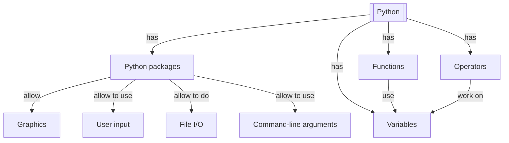

# Overview

These sessions introduce the fundamentals of the Python programming language.
You can develop in Python on an HPC cluster, or on your computer:
both are equally fine.

!!! info "Content"

    - The course emphasises hands-on experience with Python in an HPC
      environment. It focuses on the basics and can be taken by someone
      without any prior Python experience.
    - You will learn:
        - How to load and use different versions
          of Python on our clusters
        - How to create and run a Python script
        - How to work with basic builtin data types
        - How to use modules to load a Python package
        - How to read from files
        - How to write to files
        - How to create a command line program that can take input arguments
        - How to use control flow statements
        - How to draw a plot (i.e. an x-y line plot)
        - How to bundle code into reusable functions

- [Variables, expressions and statements, variables](variables_expressions_and_statements_1.md)
- [Variables, expressions and statements, operators](variables_expressions_and_statements_2.md)
- [Variables, expressions and statements, user input](variables_expressions_and_statements_3.md)
- [File IO](files.md)
- [Command line arguments](command_line_arguments.md)
- [Functions](functions.md)
