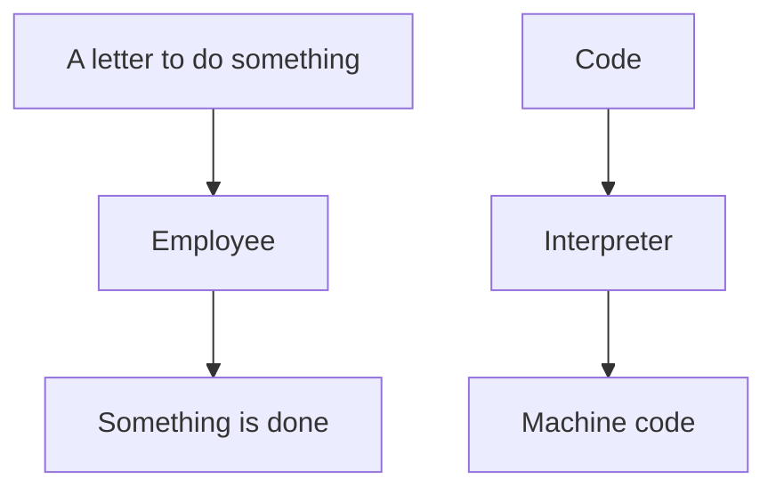

# Using the Python interpreter

!!!- info "Learning outcomes"

    - Practice using the documentation of your HPC cluster
    - To be able to login to your HPC cluster
    - To be able to load Python
    - To be able to run a minimal Python program

???- question "For teachers"

    Teaching goals are:

    - Learners have used the documentation of their HPC cluster
    - Learners have used the Python interpreter
    - Learners have loaded Python

    Other goals are:

    - Verify that learners indeed have learned how to login
    - Verify that learners indeed have learned how to use the module system

    Prior and feedback question:

    - On an HPC cluster, what are software modules?
    - On an HPC cluster, which problem do software modules solve?
    - On an HPC cluster, why don't we let users install all software themselves?
    - What does it mean that Python is an interpreted language?
    - What is an interpreter?

    Notes:

    - For those that use Bianca, it may take some time to get a login node.
      Encourage those to try Pelle while waiting


## Why software modules are important

Software modules allows users of any HPC cluster
to activate their favorite software of any version.
This helps to assure reproducible research.

## Why the Python interpreter is important



The Python interpreter is the program that lets your Python code
do something. It is at the heart of using Python: without it,
you cannot do Python programming.

## Exercises

???- question "Enjoy a video?"

    You can find a video with solutions to these exercises:

    HPC Cluster|Login method|YouTube video
    -----------|------------|-------------------------------------
    Alvis      |SSH         |[Video](https://youtu.be/R_RxKo-Vma4)
    Bianca     |SSH         |[Video](https://youtu.be/80AG-4niBgk)
    COSMOS     |SSH         |[Video](https://youtu.be/aqqHUvvolds)
    Dardel     |SSH         |[Video](https://youtu.be/BAD6y_a5xBQ)
    Kebnekaise |SSH         |[Video](https://youtu.be/DpnKUEOcIdE)
    LUMI       |SSH         |[Video](https://youtu.be/bPdvn2gajgU)
    Pelle      |SSH         |[Video](https://youtu.be/7VdutN-iUtg)
    Rackham    |SSH         |[Video](https://youtu.be/S6pYTqRmI7U)
    Tetralith  |SSH         |[Video](https://youtu.be/OBT9XuVktwg)

To develop code in Python on your HPC clusters, one needs to:

- Login to that HPC cluster, to be able to work on it
- Load the Python module, to be using the right Python interpreter and environment
- Use the Python interpreter, to run Python code

Luckily, the documentation of your HPC center
should allow you to do this by yourself!

These exercises will ensure you are able to run a minimal Python program.

???- question "How difficult will this exercise be?"

    The difficulty of these exercises depends on your HPC cluster:

    HPC cluster name|Need VPN?|Need SSH keys?|Need 2FA?|Documentation|Difficulty
    ----------------|---------|--------------|---------|-------------|----------
    Alvis           |Yes      |No            |No       |Minimal      |Medium
    Bianca          |Yes      |No            |Yes      |Excellent    |Medium
    COSMOS          |No       |No            |Yes      |Good         |Easy
    Dardel          |No       |Yes           |No       |Minimal      |Medium
    LUMI            |No       |Yes           |No       |Reasonable   |Medium
    Kebnekaise      |No       |No            |No       |Good         |Easy
    Pelle           |No       |No            |No       |Excellent    |Easy
    Rackham         |No       |No            |No       |Excellent    |Easy
    Tetralith       |No       |No            |Yes      |Good         |Easy

## Exercise 1: login to your HPC cluster

Login to your favorite HPC cluster.
This should be easy, as this is
[a prerequisite for this course](../prereqs/README.md).

## Exercise 2: load the Python module

- For your favorite HPC center,
  find the documentation on how to load a Python software module.
  Search **for a maximum of 5 minutes**!
  If you cannot find it, use
  [the UPPMAX documentation about Python](http://docs.uppmax.uu.se/software/python/)
  or ask the AI at [the UPPMAX documentation](https://docs.uppmax.uu.se)

???- question "Answer"

    From the documentation of your center, searching for, for example,
    'Python module',
    you will find information on how to load the Python module.

    <!-- markdownlint-disable MD013 --><!-- Tables cannot be split up over lines, hence will break 80 characters per line -->

    HPC Cluster|Documentation
    -----------|------------------------------------------------------------------------------------------------------------------------------------------------------------------------------------------
    Alvis      |[Short documentation](https://www.c3se.chalmers.se/documentation/module_system/python_example/) or [long documentation](https://www.c3se.chalmers.se/documentation/module_system/modules/)
    Bianca     |[Documentation](https://docs.uppmax.uu.se/software/python/#loading-python)
    COSMOS     |[Documentation](https://lunarc-documentation.readthedocs.io/en/latest/guides/applications/Python/)
    Dardel     |:warning: [Documentation](https://support.pdc.kth.se/doc/software/module/) and [more documentation](https://support.pdc.kth.se/doc/applications/python/)
    Kebnekaise |[Documentation](https://docs.hpc2n.umu.se/software/userinstalls/#python__packages)
    LUMI       |[Documentation](https://docs.lumi-supercomputer.eu/software/installing/python/#use-the-cray-python-module)
    Pelle      |[Documentation](http://docs.uppmax.uu.se/software/python/)
    Rackham    |[Documentation](http://docs.uppmax.uu.se/software/python/)
    Tetralith  |[Documentation](https://www.nsc.liu.se/software/python/)

    <!-- markdownlint-enable MD013 -->

- Using that documentation,
  load a Python software module of the version indicated in the
  table below.

HPC Cluster|Python version
-----------|--------------
Alvis      |`3.13.5`
Bianca     |`3.12.7`
COSMOS     |`3.11.5`
Dardel     |`3.12.3`
Kebnekaise |`3.11.3`
LUMI       |`3.11.7`
Pelle      |`3.13.5`
Rackham    |`3.12.7`
Tetralith  |`3.10.4`

???- question "Answer"

    <!-- markdownlint-disable MD013 --><!-- Tables cannot be split up over lines, hence will break 80 characters per line -->

    HPC Cluster|Documentation
    -----------|-------------------------------------------------
    Alvis      |`module load Python/3.13.5-GCCcore-14.3.0`
    Bianca     |`module load python/3.12.7`
    COSMOS     |`module load GCCcore/13.2.0 Python/3.11.5`
    Dardel     |`module load PDC python/3.12.3`
    Kebnekaise |`module load GCC/12.3.0 Python/3.11.3`
    LUMI       |`module load cray-python/3.11.7`
    Pelle      |`module load Python/3.13.5-GCCcore-14.3.0`
    Rackham    |`module load python/3.12.7`
    Tetralith  |`module load Python/3.10.4-env-hpc2-gcc-2022a-eb`

    <!-- markdownlint-enable MD013 -->

## Exercise 3: start the Python interpreter

- For your favorite HPC center,
  find the documentation on how to start the Python interpreter.
  Search **for a maximum of 5 minutes**!
  If you cannot find it, use
  [the UPPMAX documentation about how to load Python](https://docs.uppmax.uu.se/software/python/#loading-python)
  or ask the AI at [the UPPMAX documentation](https://docs.uppmax.uu.se)

???- question "Answer"

    From the documentation of your center, searching for, for example,
    'Python' or 'Python interpreter',
    you may find information on how to start the Python interpreter.

    <!-- markdownlint-disable MD013 --><!-- Tables cannot be split up over lines, hence will break 80 characters per line -->

    HPC Cluster|Documentation                                                                              |Solution
    -----------|-------------------------------------------------------------------------------------------|--------
    Alvis      |:warning:                                                                                  |`python`
    Bianca     |[Documentation](https://docs.uppmax.uu.se/software/python/#loading-python)                 |`python`
    COSMOS     |:warning:                                                                                  |`python`
    Dardel     |:warning: [Documentation](https://support.pdc.kth.se/doc/applications/python/)             |`python`
    Kebnekaise |:warning:                                                                                  |`python`
    LUMI       |:warning: [Documentation](https://docs.lumi-supercomputer.eu/software/installing/python/)  |`python`
    Pelle      |[Documentation](https://docs.uppmax.uu.se/software/python/#loading-python)                 |`python`
    Rackham    |[Documentation](https://docs.uppmax.uu.se/software/python/#loading-python)                 |`python`
    Tetralith  |[Documentation](https://www.nsc.liu.se/software/python/)                                   |`python`

    <!-- markdownlint-enable MD013 -->

    - :warning: for this specific question means that the documentation does
      not answer this (or the answer is hiding in more complicated examples).
      You may find this an acceptable omission or you may not.
      You are encouraged
      to contact your HPC center to help them help you better

- Start the Python interpreter

???- question "Answer"

    <!-- markdownlint-disable MD013 --><!-- Tables cannot be split up over lines, hence will break 80 characters per line -->

    HPC Cluster|Solution
    -----------|--------
    Alvis      |`python`
    Bianca     |`python`
    COSMOS     |`python`
    Dardel     |`python`
    Kebnekaise |`python`
    LUMI       |`python`
    Pelle      |`python`
    Rackham    |`python`
    Tetralith  |`python`

    <!-- markdownlint-enable MD013 -->

???- question "Cannot get this to work?"

    If there is no time to get this fixed during the course,
    you can also use Python on your local computer.

## Exercise 4: run a 'Hello world' program

Copy-paste the following code to the Python interpreter:

```python
print('Hello, world!')
```

Press enter.

How does that look like?

???- question "Answer"

    Your output will look similar to this:

    ```python
    $ python
    Python 3.12.3 (main, Nov  6 2024, 18:32:19) [GCC 13.2.0] on linux
    Type "help", "copyright", "credits" or "license" for more information.
    >>> print('Hello, world!')
    Hello, world!
    >>>
    ```

Congratulations, you've just run a 'Hello world' program :+1:
